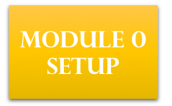
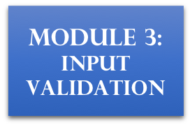
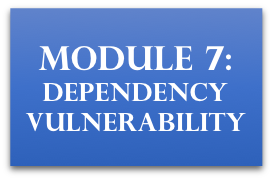
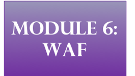

# サーバーレスセキュリティワークショップ

このワークショップでは、サーバーレスアプリケーションを保護するためのテクニックを学びます。AWS Lambda、Amazon API Gateway、およびRDS Auroraで構築されたサーバーレスアプリケーションのセキュリティを向上させるために、以下の５つのドメインで利用できる AWS のサービスと機能を説明します。 

1. アイデンティティとアクセス管理 
1. インフラストラクチャ
1. データ
1. ソースコード
1. ロギングとモニタリング

このワークショップは、サーバーレスアプリケーションの構築から始まります。このアプリケーションは、サードパーティ企業がWild Rydes の人気を活用して自社ブランドを販売できるものです。サードパーティ企業がユニコーンのカスタマイズを送信できる機能と、Wild Rydesが広告収入を受け取る機能を備えてます。

サーバレスアプリケーションは、下記のような構成になっています。

ただし、この単純なサーバーレスアプリケーションはあまり安全ではないため、このサーバーレスAPIを攻撃者から保護するための対策を実装する必要があります。 

ワークショップのモジュールを行うことで、さまざまなセキュリティの側面を改善し、このサーバーレスアプリケーションのセキュリティを向上させることができます。 

## プレゼンテーションスライド

プレゼンテーションスライドは、このGitリポジトリの`slides`ブランチの`presentation/`フォルダーにあります。 

## ワークショップ モジュール

**注**：このワークショップは、すべてのモジュールを順番に行う必要がないように設計されています。ただし、**モジュール0は、他のモジュールの作業前に行う必要があります**。 

以下のモジュール0のリンクをクリックして、ワークショップで使用するサーバーレスアプリケーションのセットアップを開始してください！ 

このワークショップのモジュールの概要と、それらがセキュリティのどの領域にマッピングされるかを以下に示します。 

<table style="text-align:center width:100%" align="center" >
  <tr>
    <th rowspan="3" width="20%"> 
    	アイデンティティとアクセス管理  ⚔   
    	
	 </th>
    <th width="60%">
    	ソースコード 🏰   
    	
    	
    	
    </th>
    <th width="20%" colspan="3" rowspan="3">ロギングとモニタリング 🕶
    	
</th>
  </tr>
  <tr >
    <td align="center" width="60%">
    	データ 🏆  	    
    	
    </td>
  </tr>
  <tr>
    <td align="center" width="60%">インフラストラクチャ 🛡  
 		
  		
	</td>
    </tr>
</table>

## リソースのクリーンアップ

 以下をクリックして、リソースのクリーンアップ手順に進みます。 

## ライセンスについて

The documentation is made available under the Creative Commons Attribution-ShareAlike 4.0 International License. See the LICENSE file.

The sample 
within this documentation is made available under a modified MIT license. See the LICENSE-SAMPLECODE file.