# モジュール0：初期セットアップ

このモジュールでは、ワークショップで利用するサーバーレスアプリケーションをデプロイします。このアプリケーションは、Wild Rydes のパートナー企業が自社ブランドのロゴのはいったソックスやケープ(マント)など、ユニコーンをカスタマイズして会社を宣伝できるように、REST API エンドポイントを有しています。下記は、展開するアーキテクチャの概要です。 

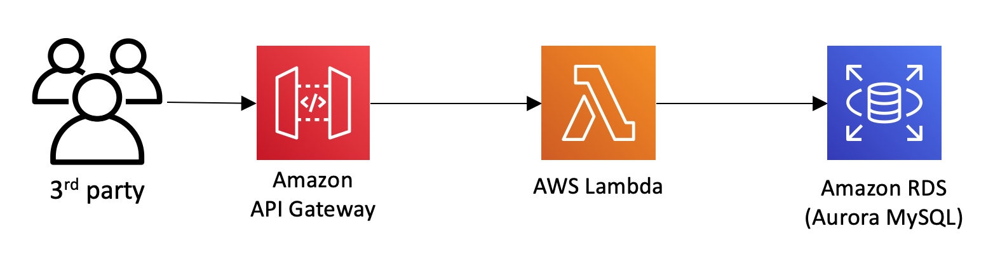


## 前提条件

AWS主催のイベントで、**AWS Event Engine**を利用したワークショップの場合、次のステップに進むことができます。

AWS Event Engineを利用していないイベントの場合は、以下を展開して前提条件を確認してください。 

<details>
<summary><strong> AWS Event Engineを利用していないイベントの場合 </strong></summary><p>


### AWS アカウント
このワークショップでは、Cloud9、Cognito、API Gateway、Lambda、RDS、WAF、Secrets Manager、IAM ポリシー、IAMロールを利用します。このAWSリソースを作成、管理するためAWSアカウントとアクセス権が必要です。

このワークショップの手順は、一度に1人の参加者のみが特定のAWSアカウントを使用していることを前提としています。別の参加者とアカウントを共有しようとすると、特定のリソースで名前の競合が発生する場合があります。個別のリージョンを使用することでこの問題を回避できますが、この作業を行うための手順は記載されていません。 

本番用のAWS環境、アカウントを使用しないでください。代わりに、必要なサービスへの**フルアクセス**できる権限をもった**検証アカウント**を使用することをお勧めします。 


### リージョンの選択
このワークショップは全体を通して１つのリージョンを使用します。このワークショップは、北米の2つのリージョンとヨーロッパの1つのリージョンをサポートしています。以下の起動スタックリンクから1つのリージョンを選択し、以後そのリージョンを使用し続けてください。

</details>

## モジュール-0A：VPC および Cloud9 環境の作成

下記を作成します。

* Cloud9環境：IDEとして利用します（統合開発環境）
* RDS Aurora MySQL ：サーバーレスアプリケーションのバックエンドデータベースとして利用します

CloudFormation は以下のリソースも作成します。 

* 4つのサブネットを持つ**VPC**（プライベートサブネット２つ、パブリックサブネット２つで構成）
* **Cloud9** ワークショップで作業を行う環境
* **MySQL Aurora RDSデータベース**（プライマリDBインスタンスが2つのプライベートサブネットのいずれかに存在）

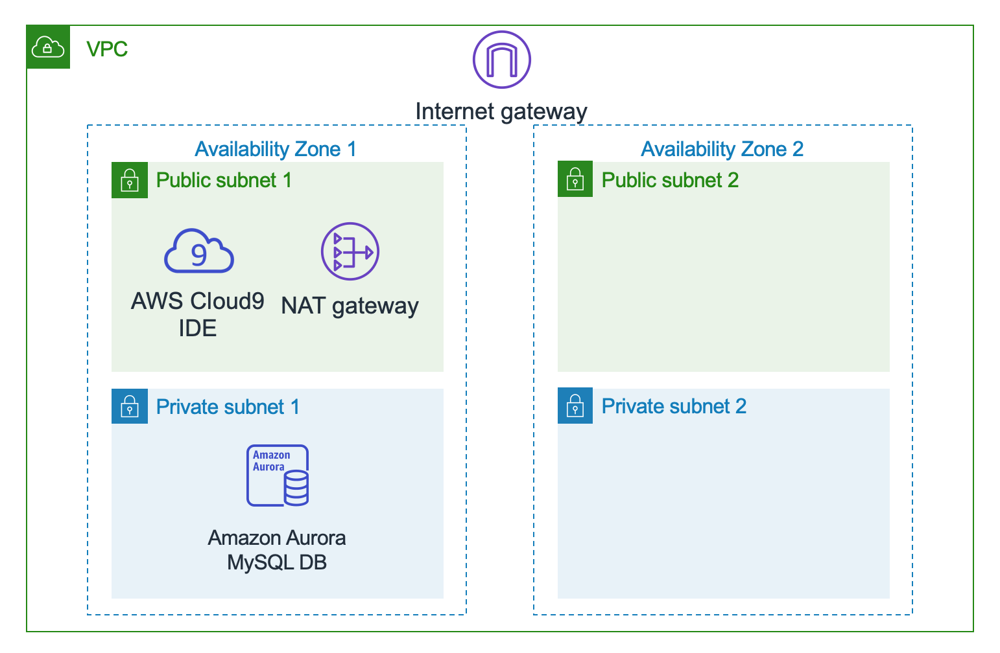


さらに、以下のリソースも作成しています。

* **S3バケット**: Lambda関数コードのパッケージ化とアップロードのために後で使用
* **セキュリティグループ**: Lambda関数によって使用


**ワークショップの提供形態に応じて以下のオプションをクリックし、手順を実行してください:**

<details>
<summary><strong> オプション 1: AWS Event Engineを利用したイベントの場合 </strong></summary><p>
If you are using AWS Event Engine, an AWS CloudFormation stack should be automatically created for you.

1. [https://dashboard.eventengine.run](https://dashboard.eventengine.run)に移動します。

1. 次の画面で、イベント主催者から受け取ったハッシュコードを入力し、**Proceed** をクリックします。

   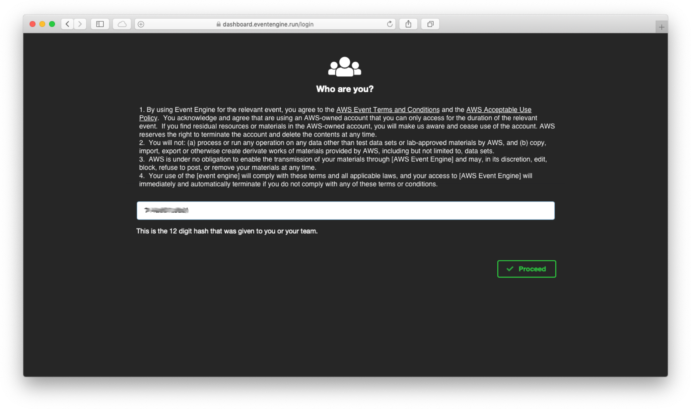

1. **AWS Console** をクリックします。

   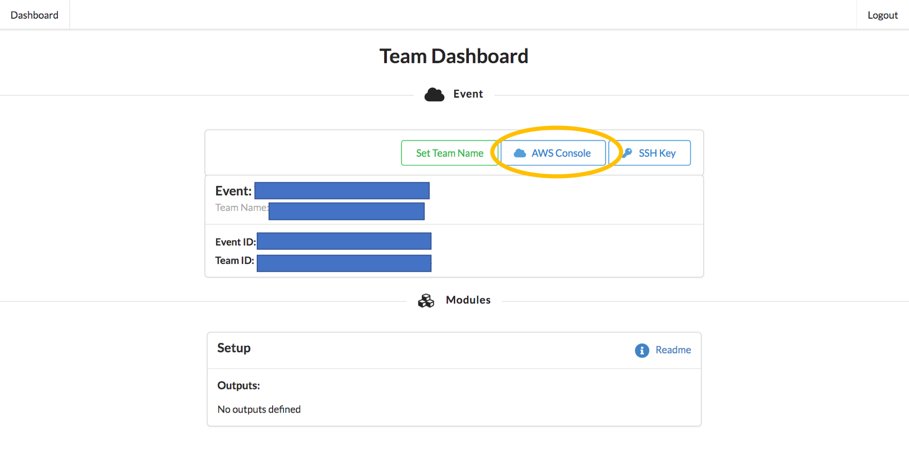

1. **Open AWS Console** をクリックします。または、**Copy Login Link** をクリックし **Chrome** か **Firefox**でこのリンクを開いてください。
   
    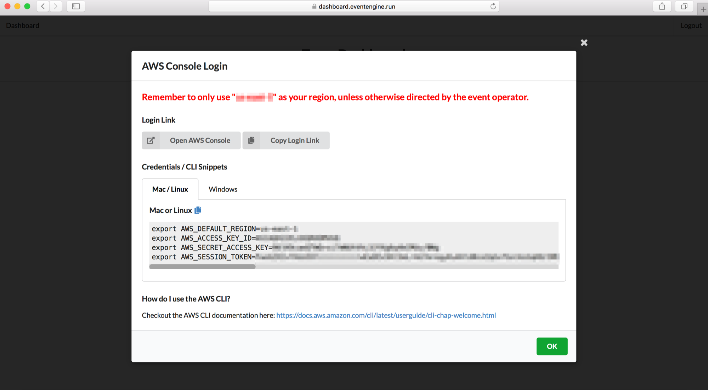
    
1. CloudFormation のコンソールへ移動します。**サービス** をクリックし `CloudFormation` を入力しクリックしてください。

1. ２つのスタックが作成されていることを確認します。
   * **メインスタック**：`mod-3269ecbd5edf43ac` のような名前です。主なリソースが含まれます。
   * ネストスタック：`aws-cloud9-Secure-Serverless-Cloud9-<alphanumeric-letters>`のような名前です。作業用の Cloud9 環境が含まれます。
   
1. **メインスタック** (`mod-`から始まるスタック)を選択し、**Outputs** タブをクリックします。このページをワークショップ中開いておいて、参照できるようにしておいてください。

    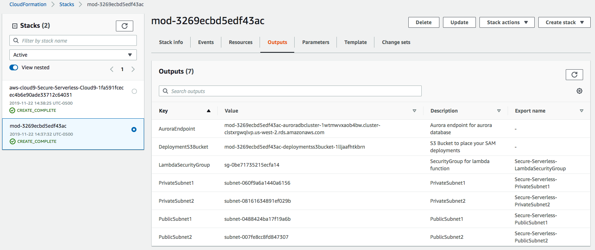
    

</details>

<details>
<summary><strong> Option 2: 個人の AWS アカウントを利用する場合</strong></summary><p>
個人の AWS アカウントを利用する場合、CloudFormation テンプレートを利用しセットアップを行います。

1. いずれかのリージョンを選択して、下記の **Launch Stack** ボタンをクリックしてください。Aurora や Cloud9 などのサービスを作成します。

	&#128161; **リンクをクリックするときは、⌘（mac）またはCtrl（Windows）を押したままにして、新しいタブで開くようにします** &#128161;

	リージョン| リージョンコード | リンク 
	------|------|-------
	EU (アイルランド) | <span style="font-family:'Courier';">eu-west-1</span> | [](https://console.aws.amazon.com/cloudformation/home?region=eu-west-1#/stacks/new?stackName=Secure-Serverless&templateURL=https://s3.amazonaws.com/wildrydes-us-east-1/Security/init-template.yml)
	US West (オレゴン) | <span style="font-family:'Courier';">us-west-2</span> | [](https://console.aws.amazon.com/cloudformation/home?region=us-west-2#/stacks/new?stackName=Secure-Serverless&templateURL=https://s3.amazonaws.com/wildrydes-us-east-1/Security/init-template.yml)
	US East (バージニア北部) | <span style="font-family:'Courier';">us-east-1</span> | [](https://console.aws.amazon.com/cloudformation/home?region=us-east-1#/stacks/new?stackName=Secure-Serverless&templateURL=https://s3.amazonaws.com/wildrydes-us-east-1/Security/init-template.yml)

1. **次へ**をクリックします 

1. **ステップ2：スタックの詳細を指定** ページで下記を入力してクリックします。
	
	* スタックの名前  ***`Secure-Serverless`***
	* データベースのパスワード  ***`Corp123!`***
	
	> 注：別のパスワードも指定できます。ただし、パスワードは８文字以上である必要があります。また、後のmodule-0Dで `src/app/dbUtils.js`ファイルに記載されたパスワードを変更する必要があります。 
	
1.  **ステップ3：スタックオプションの 設定** ページで、そのまま **次へ** をクリックします。

1. 構成を確認し、**スタックの作成** をクリックします。 

1. CloudFormation スタックの作成が完了するのを待っている間に、ラップトップに **PostMan** がインストールされているか確認してください。そうでない場合は、[https](https://www.getpostman.com/):[//www.getpostman.com](https://www.getpostman.com/)からダウンロードしてインストールします。後で使用します。 

1. スタックの作成には数分かかります。画面左上の[ **スタック** ]を選択して、スタック一覧ページに移動し、スタックが *CREATE_COMPLETE* のステータスが表示されるまで待ちます。更新アイコンを定期的にクリックして、進捗状況を確認してください。 

	> 注：CloudFormation はネストされたスタックをデプロイして、Cloud9 リソースを起動します。「aws-cloud9-Secure-Serverless-」というプレフィックスが付いたテンプレートは無視しても問題ありません。 

1. CloudFormation の作成が完了したら、**Secure-Serverless** スタックの **出力** タブに移動し、**AuroraEndpoint** をテキストエディターにコピーします。次のステップで Aurora データベースに接続するために利用します。（このページをワークショップ中開いておいて、参照できるようにしておいてください）

	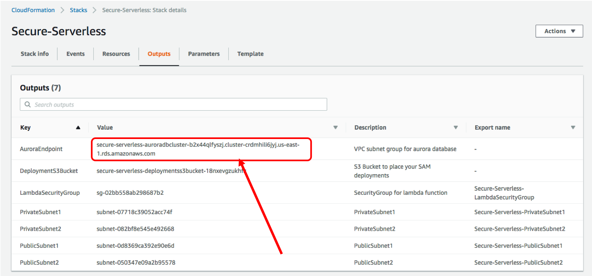

</details>


## Module-0B: Cloud9 への接続

前回のステップで[Cloud9 IDE インスタンス](https://aws.amazon.com/cloud9/) が作成されています。このワークショップでのコーディングとコマンドは、この Cloud9 IDE 環境内で実行していきます。

1. 新しいブラウザタブを開き Cloud9 コンソール `https://console.aws.amazon.com/cloud9/home`へ接続します ( AWS コンソール上部のナビゲーションバーで **サービス** をクリックして、`cloud9`と検索して移動することもできます） 

1. ***Your environments*** をクリックします（左側のサイドバーを展開する必要がある場合があります） 

	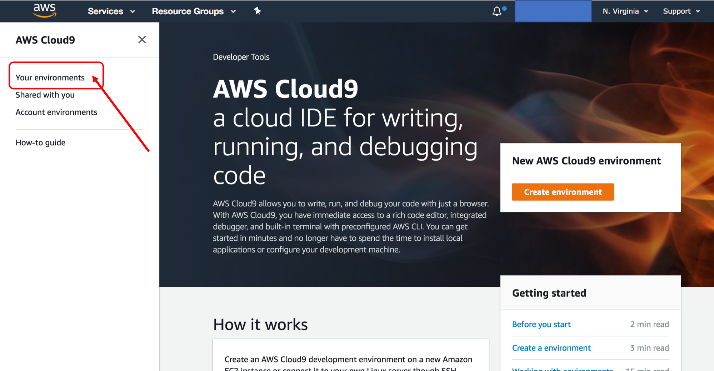

1. *Secure-Serverless-Cloud9* 環境の ***Open IDE***  をクリックします

	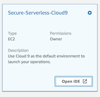
	
	Cloud9 を開けない場合は、以下を使用していることを確認してください。 
	* Cloud9 環境が表示されない場合：展開したリージョンを表示しているか
	* **Chrome** または **Firefox** のブラウザ
	* サードパーティの Cookie が有効になっていることを確認　[**シューティングガイド**](https://docs.aws.amazon.com/cloud9/latest/user-guide/troubleshooting.html#troubleshooting-env-loading)
	
1. 次のように、統合開発環境（IDE）環境が表示されます。AWS Cloud9 は、ブラウザのみでコードを記述、実行、デバッグできるクラウドベースの IDE です。また、ターミナルウィンドウでシェルコマンドも実行できます。 

	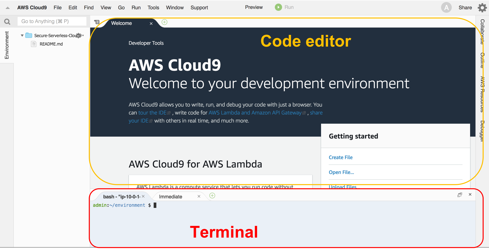

	 

1. このワークショップのコンテンツを取得します。Cloud9 ターミナルウィンドウ（画面下部）で、次のコマンドを実行して、このリポジトリのクローンを作成します。

	`git clone https://github.com/aws-samples/aws-serverless-security-workshop.git`

    ※ターミナルウィンドウの画面を広くすると、より効率的に作業ができます。
   
   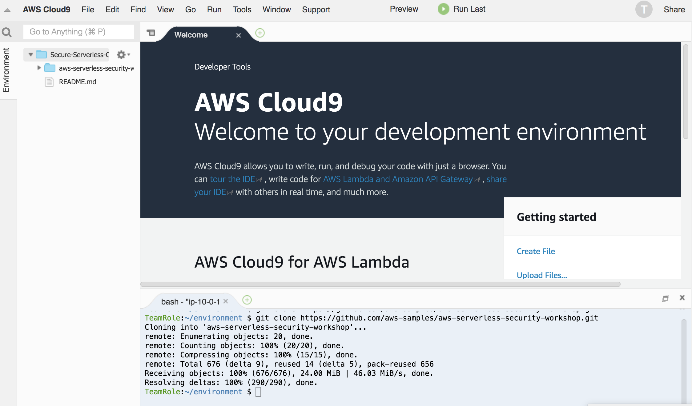

	:bulb:**Tip:**  このワークショップを通して、 AWS Cloud9 IDE を開いたままにしてください。多くの作業で使用します。

1.  Cloud9 で新しいファイルを作成します。

    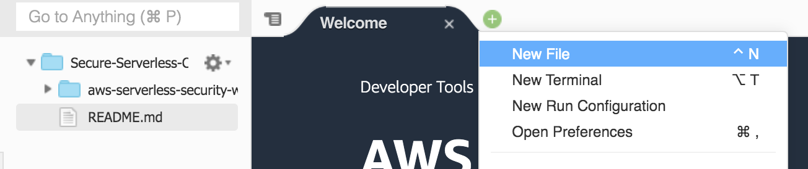

1.  別に開いてある CloudFormation コンソールの画面から、**出力**の下に表示されたリソースID をコピーアンドペーストします。  `scratch.txt` として保存してください。

    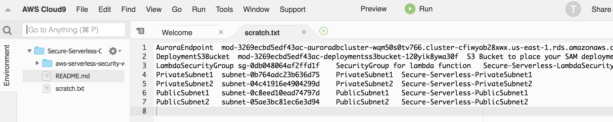
    

## Module-0C: データベースの準備

いくつかのテーブルを作成し、Aurora データベースに初期値を追加していきます。Aurora データベースはModule-0A でプライベートサブネットで起動されているため、データベースはインターネットから直接接続できないようになっています。

Cloud9 インスタンスとAuroraデータベースは同じ VPC にあるため、Cloud9 インスタンスからデータベースを管理できます（データベースのセキュリティグループは、接続を許可するように構成されています）。 

データベースの準備：

1. Cloud9 のターミナルウィンドウで、リポジトリのフォルダーに移動します 。

 	```
 	cd aws-serverless-security-workshop/
 	```

    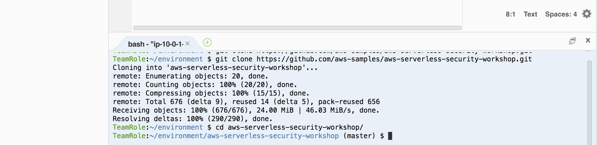

1. 次のコマンドを使用してクラスターに接続します。**エンドポイントの情報をコピーしたものに置き換えます**。

	`mysql -h <YOUR-AURORA-SERVERLESS-ENDPOINT> -u admin -p`

	パスワードを求められるので *`Corp123!`* （もしくは個別に指定したもの）を入力します

1. mysql コマンドプロンプトで (`mysql> `)、次のコマンドを入力します。 

	`source src/init/db/queries.sql`
	
	次のような出力が表示されるはずです。 
	
	``` bash
	mysql> source src/init/db/queries.sql
	Query OK, 1 row affected (0.01 sec)
	
	Database changed
	Query OK, 0 rows affected (0.02 sec)
	
	Query OK, 0 rows affected (0.02 sec)
	
	Query OK, 0 rows affected (0.02 sec)
	
	Query OK, 0 rows affected (0.02 sec)
	
	Query OK, 0 rows affected (0.02 sec)
	
	Query OK, 0 rows affected (0.03 sec)
	
	Query OK, 1 row affected, 1 warning (0.00 sec)
	
	Query OK, 2 rows affected (0.01 sec)
	Records: 2  Duplicates: 0  Warnings: 0
	
	Query OK, 8 rows affected (0.01 sec)
	Records: 8  Duplicates: 0  Warnings: 0
	
	Query OK, 7 rows affected (0.00 sec)
	Records: 7  Duplicates: 0  Warnings: 0
	
	Query OK, 4 rows affected (0.00 sec)
	Records: 4  Duplicates: 0  Warnings: 0
		
	mysql> 
	```

1. 次の SQL クエリを実行して、テーブルの内容を調べます。
	
	```sql 
	SHOW tables;
	```

	 テーブルの内容が表示されます 。

	```sql 
	mysql> SHOW tables;
	+---------------------------------+
	| Tables_in_unicorn_customization |
	+---------------------------------+
	| Capes                           |
	| Companies                       |
	| Custom_Unicorns                 |
	| Glasses                         |
	| Horns                           |
	| Socks                           |
	+---------------------------------+
	6 rows in set (0.00 sec)
	```

	  次の SQL クエリを実行して、Capes テーブルの内容を調べます。
	
	```sql 
	SELECT * FROM Capes;
	```

	  テーブルの内容が表示されます 。
	
	```sql
	mysql> SELECT * FROM Capes;
	+----+--------------------+-------+
	| ID | NAME               | PRICE |
	+----+--------------------+-------+
	|  1 | White              |  0.00 |
	|  2 | Rainbow            |  2.00 |
	|  3 | Branded on White   |  3.00 |
	|  4 | Branded on Rainbow |  4.00 |
	+----+--------------------+-------+
	4 rows in set (0.00 sec)
	```

1. 内容の確認が終わったら、 `exit` コマンドを使用して mysql 接続を切断します。

## Module-0D: サーバーレスアプリケーションのコード確認

Lambda 関数のコードは `aws-serverless-security-workshop/src/app`にあります。このフォルダーに移動し、まず次のコマンドでノードの依存関係をインストールしてきます。 
	
```sh
$ cd ~/environment/aws-serverless-security-workshop/src/app
$ npm install
```

> 注: もし下記の警告が表示されても無視してください。この部分は [**module 7**](../07-dependency-vulnerability/README.md) で扱います :)
> 
> 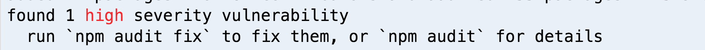

この`src/app` フォルダーにはいくつかのファイルがあります。
- **unicornParts.js**: ユニコーンカスタマイズオプションを一覧表示する Lambda 関数のメインファイル
- **customizeUnicorn.js**: ユニコーンカスタマイズ構成の作成/記述/削除を処理する Lambda 関数のメインファイル
- **dbUtils.js**: このファイルには、アプリケーションのすべてのデータベース/クエリロジックが含まれています。また、すべての接続情報が平文で書かれています（！） 


Cloud9 のサイドバーでこれらのファイルを探して、コードを確認してください。

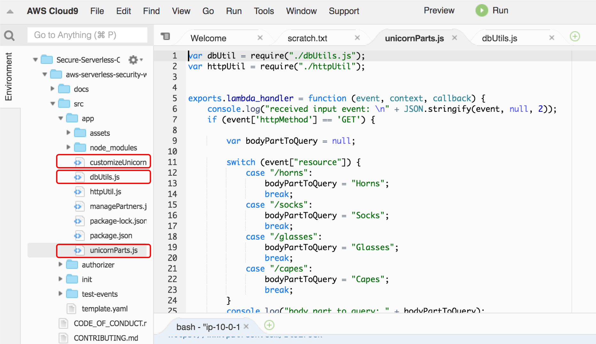


さらに、フォルダーには下記のファイルもあります。今はこれらを厳密に確認する必要はありません。 

- **httpUtils.js**:  アプリケーションからの http 応答ロジックが含まれています 
- **managePartners.js**: 新しいパートナー企業を登録するためのロジックを処理する Lambda 関数のメインファイル。これについてはモジュール1で詳しく説明します 。
- **package.json**: Nodejs プロジェクトマニフェストのファイル（コードの依存関係のリストを含む）

コードに加えて、Lambda 関数と REST API の構成は`template.yaml` に **AWS SAM**（Serverless Application Model）テンプレートとして記述されています。 

[AWS SAM](https://github.com/awslabs/serverless-application-model) を利用すると、簡潔な構文でサーバーレスアプリケーションを定義できます。`template.yaml`では３つの Lambda 関数が定義されており、Swagger テンプレートで定義された REST API にマッピングされていることがわかります。

<table>
  <tr>
    <th>Lambda 関数</th>
    <th>Main handler code</th>
    <th>API リソース</th>
    <th>HTTP メソッド</th>
    <th>説明</th>
  </tr>
  <tr>
    <td rowspan="4">UnicornPartsFunction</td>
    <td rowspan="4">unicornParts.js</td>
    <td>/horns</td>
    <td>GET</td>
    <td>horn(角)のカスタマイズオプションの一覧</td>
  </tr>
  <tr>
    <td>/glasses</td>
    <td>GET</td>
    <td>glasses(メガネ)のカスタマイズオプションの一覧</td>
  </tr>
  <tr>
    <td>/socks</td>
    <td>GET</td>
    <td>socks(ソックス)のカスタマイズオプションの一覧</td>
  </tr>
  <tr>
    <td>/capes</td>
    <td>GET</td>
    <td>capes(マント)のカスタマイズオプションと一覧</td>
  </tr>
  <tr>
    <td rowspan="4">CustomizeUnicornFunction</td>
    <td rowspan="4">customizeUnicorn.js</td>
    <td>/customizations</td>
    <td>POST</td>
    <td>ユニコーンのカスタマイズの作成</td>
  </tr>
  <tr>
    <td>/customizations</td>
    <td>GET</td>
    <td>ユニコーンのカスタマイズの一覧</td>
  </tr>
  <tr>
    <td>/customizations/{id}</td>
    <td>GET</td>
    <td>ユニコーンのカスタマイズの詳細</td>
  </tr>
  <tr>
    <td>/customizations/{id}</td>
    <td>DELETE</td>
    <td>ユニコーンのカスタマイズの削除</td>
  </tr>
  <tr>
    <td>ManagePartnerFunction</td>
    <td>managePartners.js</td>
    <td>/partners</td>
    <td>POST</td>
    <td>パートナー企業の新規登録</td>
  </tr
</table>

## Module-0E: SAM Local によるアプリケーションのローカル実行

1. コードを確認した後、 **src/app/dbUtils.js** の *host* 情報を Aurora エンドポイントに置き換えて保存します（Macの場合は⌘+ s、Windowsの場合はCtrl + s、またはファイル->保存） 
   
   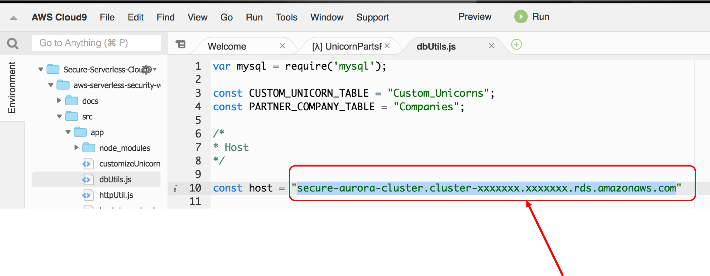

   :bulb: ファイル変更後に保存を行っていない場合、ファイル名の右側に灰色のマークが表示されます。
   
   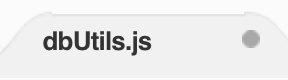
   
   SAM Local を使用してローカルで API をテストしていきます。

1. **右のパネル** にある **AWS Resource** をクリック

	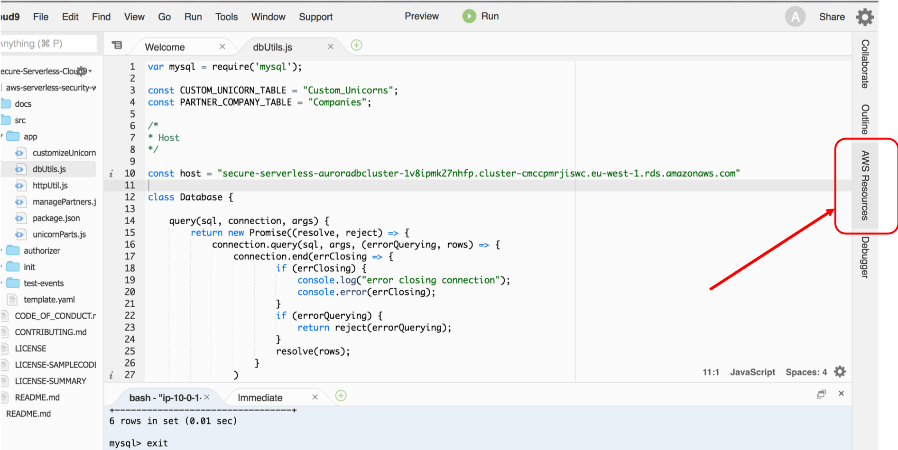

1. *Local Functions (1)*という名前のフォルダーツリーが表示されます。

1. `src` フォルダーの下にある **UnicornPartsFunction** を選択します 

1. 上部パネルのドロップダウンをクリックし、**Run APIGateway Local** を選択します 

	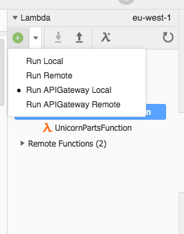

1. 次に、再生アイコンをクリックします。API をローカルでテストするための新しいパネルが表示されます

1. 表示されたパネルの **Path** パラメータに`/socks`と表示されているはずです。（表示のない場合は、ユニコーンの部品（例えば`/socks`、`/glasses`、`/capes`、`/horns`など）を選択してしてください。）そして**Run **をクリックします

	> API を初めてローカルでテストする場合、Docker がイメージを pull してセットアップするために最大1〜2分かかります。

	レスポンスとして `200 OK` を取得できるはずです。
	
	スクリーンショットの例:
	
	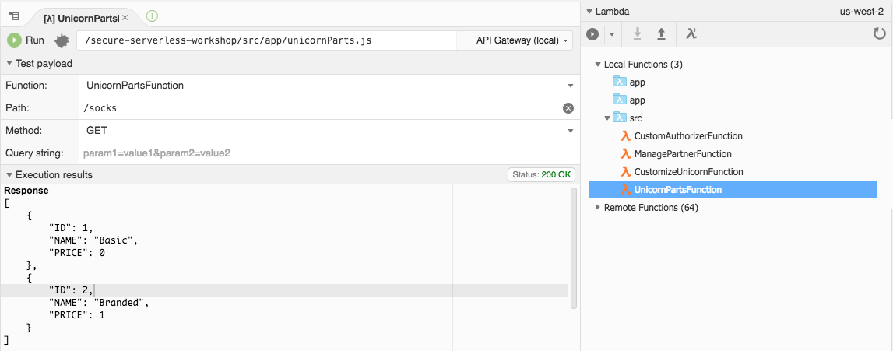
	
	

これは、アプリケーションが Cloud9 環境内（ローカル）で正常に実行できたことを示しています。これで、サーバーレスアプリケーションをデプロイする準備が整いました！

## Module-0F: アプリケーションのデプロイとテスト

1. CloudFormation スタックが作成した S3 バケットの名前を確認します。

	* scratch.txtから、**DeploymentS3Bucket**を探します。
	
	  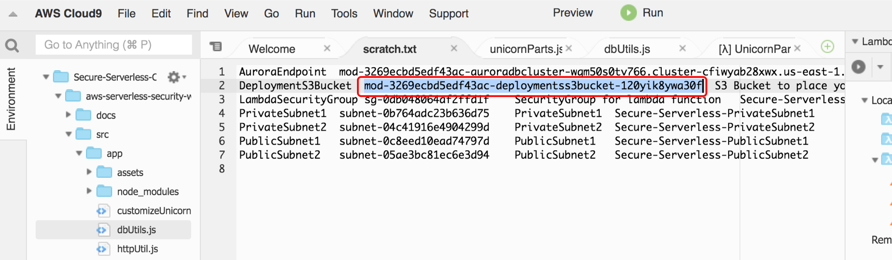
	
	* 見つからない場合は、Cloudformation コンソールの**出力**タブから**DeploymentS3Bucket** を探します。 

	  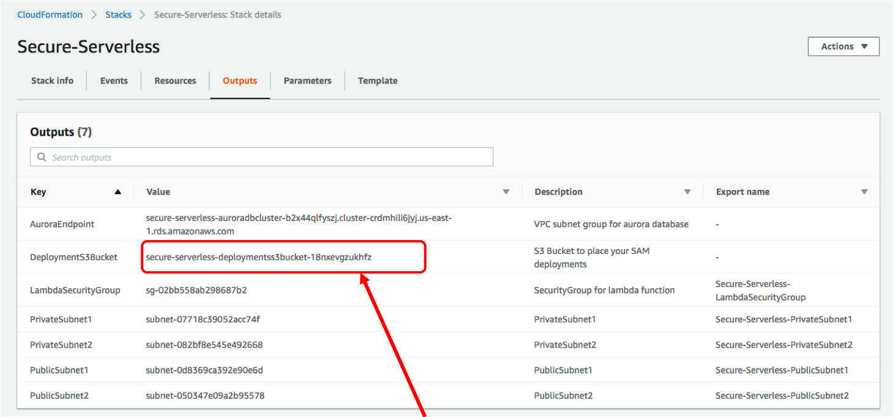

1. ターミナルで、bash 変数を設定します ( REGION 変数と BUCKET 変数を設定)

	```
	REGION=`ec2-metadata -z | awk '{print $2}' | sed 's/[a-z]$//'`
	BUCKET=<DeploymentS3Bucketの値を入力>
	```
	
1. `src` フォルダー内にいることを確認します

	```
	cd ~/environment/aws-serverless-security-workshop/src
	```

1. 以下を実行して Lambda コードをパッケージ化し、S3 にアップロードし、コードをホストする S3 パスを参照するように CloudFormation テンプレートを更新します

	```
	aws cloudformation package --template-file template.yaml --s3-bucket $BUCKET --output-template packaged.yaml
	```

1. 次のコマンドを使用してサーバーレス API をデプロイします。このテンプレートは、CloudFormation スタック (`Secure-Serverless`) からサブネット ID などの出力を参照していることに注意してください

	```
	aws cloudformation deploy --template-file packaged.yaml --stack-name CustomizeUnicorns --region $REGION --capabilities CAPABILITY_IAM --parameter-overrides InitResourceStack=Secure-Serverless
	```

1. スタックが正常にデプロイされるまで待ちます

	```
	Waiting for changeset to be created..
	Waiting for stack create/update to complete
	Successfully created/updated stack - CustomizeUnicorns
	```

1. CloudFormation スタックの出力から、デプロイしたサーバーレス API のベースエンドポイントを確認できます。

	コマンドラインから下記を入力して確認できます。

	```
	aws cloudformation describe-stacks --region $REGION --stack-name CustomizeUnicorns --query "Stacks[0].Outputs[0].OutputValue" --output text
	```

	出力例:
	```
	$ aws cloudformation describe-stacks --region $REGION --stack-name CustomizeUnicorns --query "Stacks[0].Outputs[0].OutputValue" --output text
	https://rs86gmk5bf.execute-api.us-west-2.amazonaws.com/dev/
	```

	 または [CloudFormation コンソール](https://console.aws.amazon.com/cloudformation/home)で、`CustomizeUnicorns` スタックの **出力** タブでも確認できます。

1. ブラウザ（または `curl`) で次の API をテストします。先ほど確認した API ベースエンドポイントに API パス(例： `/socks`) を追加することを忘れないでください 

	<table>
	  <tr>
	    <th>API</th>
	    <th>HTTP メソッド</th> 
	    <th>パス</th> 
	  </tr>
	  <tr>
	    <td> horn(角) のカスタマイズオプションと価格の一覧</td>
	    <td>GET</td> 
	    <td>/horns</td>
	  </tr>
	  <tr>
	    <td> glasses(メガネ) のカスタマイズオプションと価格の一覧  </td>
	    <td>GET </td> 
	    <td>/glasses</td>
	  </tr>
	  <tr>
	    <td> capes(マント) のカスタマイズオプションと価格の一覧 </td>
	    <td>GET</td> 
	    <td>/capes </td>
	  </tr>
	  <tr>
	    <td> socks(ソックス) のカスタマイズオプションと価格の一覧 </td>
	    <td> GET </td> 
	    <td>/socks </td>
	  </tr>
	</table>
	
	出力例:
	
	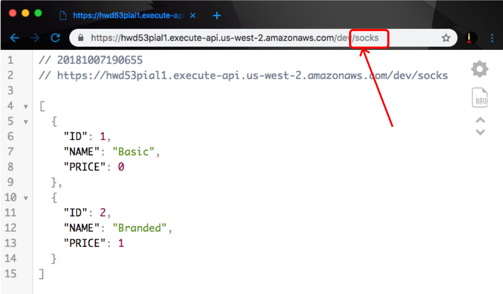

	
## Module-0G: Postman のセットアップと API テスト


最後に、[**Postman**](https://www.getpostman.com/) を使用して API リクエストをテストします。

1. パソコンに Postman をインストールしていない場合は、[https://www.getpostman.com/](https://www.getpostman.com/)からダウンロードしてインストールしてください 

1. 各 API をテストできる Postman コレクションをインポートします。 

	* postman の **Import** ボタンをクリックします。
	* 次に、 **Import from Link** から以下のリンクを指定します。

		`https://raw.githubusercontent.com/aws-samples/aws-serverless-security-workshop/master/src/test-events/Customize_Unicorns.postman_collection.json`
		
		
		
		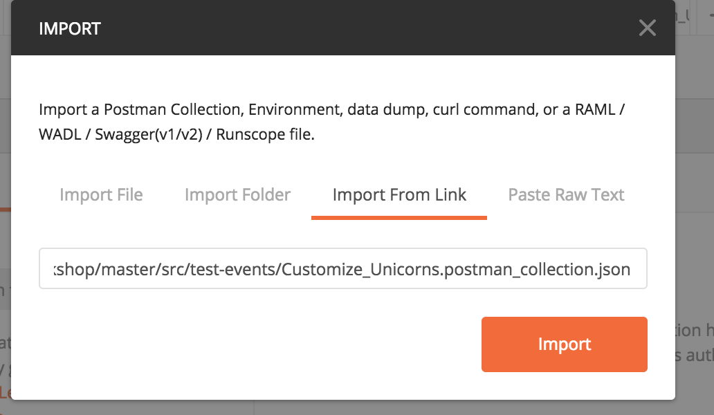
	
1. 画面左側に、`Customize_Unicorns` というコレクションが表示されます。

	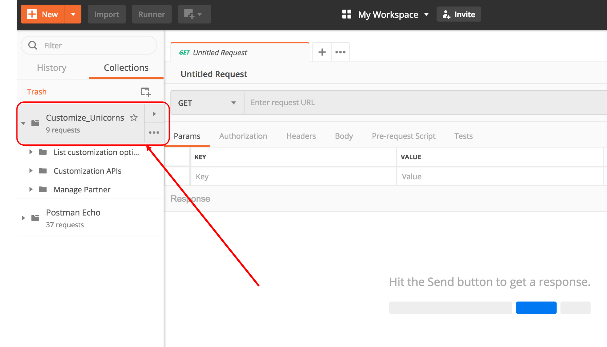

1. postman の環境を作成し、`base_url` 変数を設定します。
	1. 画面右上の &#9881; アイコンから (“Manage Environments”) をクリックします

	   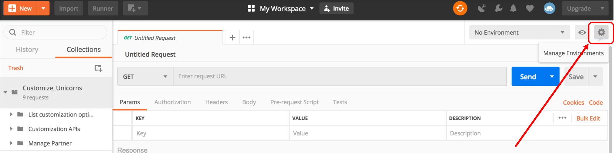
	
	1. **Add** ボタンをクリックして新しい環境を作成します。
	1. 環境名 `dev` を入力します
	1. `base_url` 変数を追加し、 先程作成した API ベースエンドポイントを値として入力します。

	   &#9888; **値の最後に `/`をつけないように注意してください！**  &#9888;

	   スクリーンショットの例

	   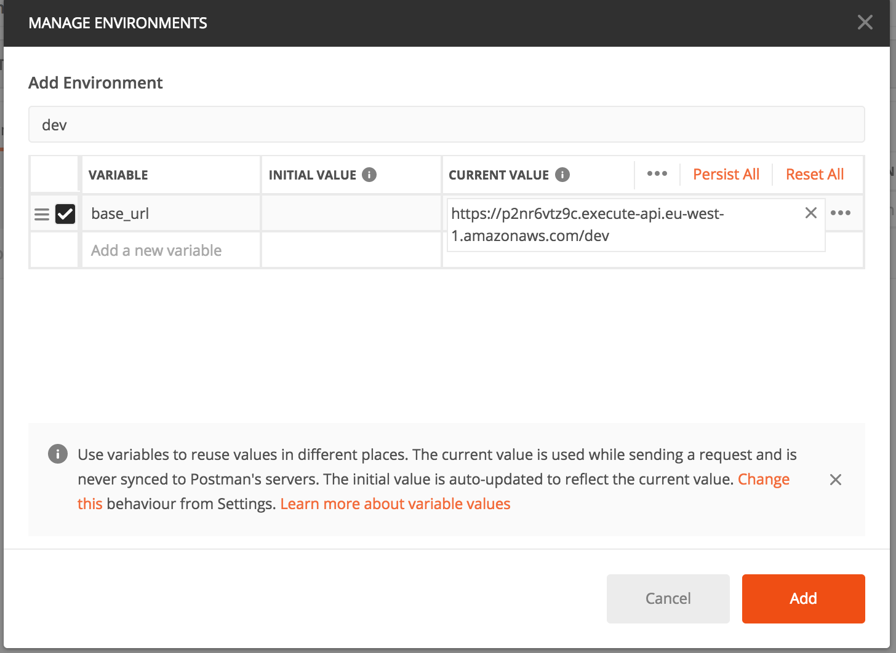
	
	> Postmanの環境と変数の詳細は[managing environments](https://www.getpostman.com/docs/v6/postman/environments_and_globals/manage_environments) で確認できます
	
1. **Add** をクリックして `dev` 環境を作成したのち 、**X** をクリックして Manage Environments を終了します。

1. 画面右上のドロップダウンメニューから`dev` を選択します。

	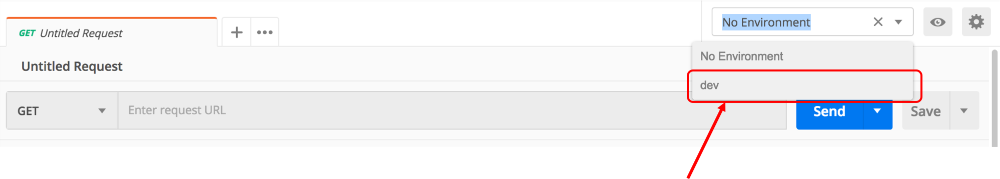

1. Postman を使ってAPIをテストする用意ができました。画面左のサイドバーから`Customize_Unicorns` コレクションをクリックし、 `List customization options` フォルダを開きます。 フォルダの中の API を1つ選択し、**Send** ボタンをクリックしてリクエストを送信し、結果を確認します。

	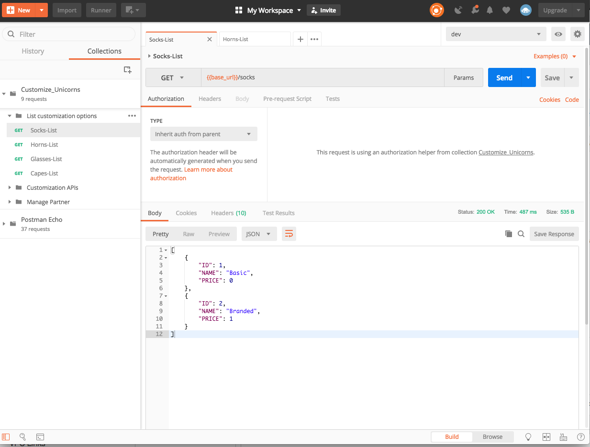


## 次のステップ
デプロイしたサーバーレスアプリケーションの保護を開始します。ワークショップの [トップページ](../../README.md) に戻り、次のモジュールを選択してください。

