# モジュール 1: 認証と認可の追加

さきほど展開したサーバーレスアプリは、世界中の誰でもアクセスできるようになっています。攻撃者はユニコーンのカスタマイズ要求を何回でも送信でき、誰がリクエストを行ったかを知る方法はありません。

API へのアクセスを信頼できるパートナー企業のみに制限するには、認証と認可の機能を追加する必要があります。  

今回のシナリオでは、パートナー企業はプログラムで API にアクセスするので、認証を実装するためのいくつかの選択肢が考えられます。

* **API Key** - 最も簡単なオプションですが、柔軟性はあまりありません。たとえば、きめ細かなアクセス制御が必要な場合は、独自の認証システムを構築する必要があります（たとえば、異なるクライアントが異なる API へのアクセスを必要とするケースなど）
* **OAuth** [**クライアント認証情報フロー**](https://tools.ietf.org/html/rfc6749#section-4.4) - クライアントが認証情報を使用して認証サーバー（この例では Amazon Cognito）で認証し、アクセストークンを取得し、API を呼び出す標準的な方法です。

	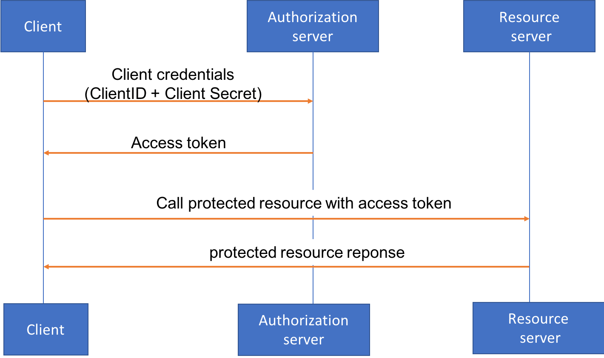
	

このワークショップでは、OAuth クライアント認証を利用します。API Key を使用する場合と比較して、OAuth クライアント認証情報フローを使用すると、次のことが可能になります。

* 異なる認証 [**スコープ**](https://www.oauth.com/oauth2-servers/scope/) を簡単に定義でき、異なる種類のクライアントが異なるAPIやリソースにアクセスさせやすい。
* 将来の拡張として、プログラムによるアクセスではなく、Wild Rydes が管理する Web UI を介して API に接続するケースがあるかもしれません。または、サードパーティーの企業が顧客に代わってリクエストを行うカスタムアプリを構築できるようにしたいケースもあります ( [別ワークショップの例](https://github.com/aws-samples/aws-serverless-workshops/tree/master/WebApplication/5_OAuth) ). OAuth アクセストークンで認証する API を設計することで、これらの将来的な拡張を柔軟に対応できます。  

このモジュールでは、**Amazon Cognito** を **認証サーバー**として使用し、API Gateway 用の [**Lambda オーソライザー**](https://docs.aws.amazon.com/apigateway/latest/developerguide/apigateway-use-lambda-authorizer.html) を活用することで、トークンを検査しアクセスポリシーを割り当てます。このモジュールを実施した後のアーキテクチャは次のようになります。   

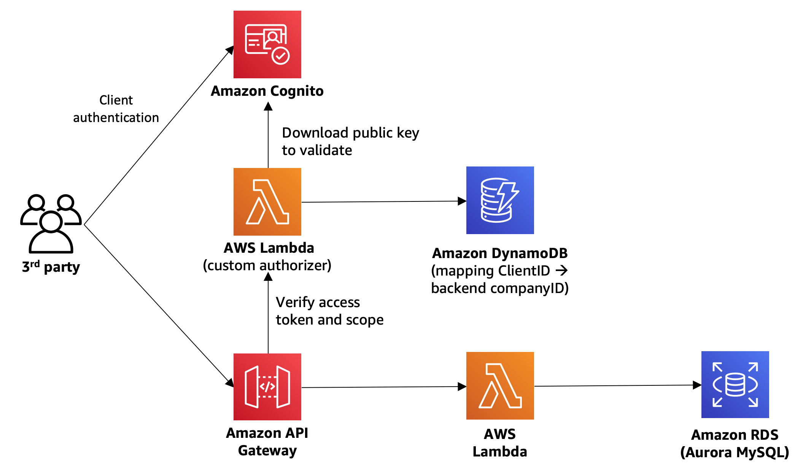

> 注意：このモジュールを実行すると、モジュール0D で行った Cloud9 でのローカルテストができなくなります（ローカルでテストするためアクセス権限がなくなるため）

## **モジュール 1 の手順**

このモジュールは、サブモジュールA~Fで構成されています。

* [**モジュール 1A**](#1A) : Cognito ユーザープールとドメインの作成
* [**モジュール 1B**](#1B) : Cognito ユーザープールで認証スコープの作成
* [**モジュール 1C**](#1C) : 内部管理用アカウントのクライアント認証情報の作成
* [**モジュール 1D**](#1D) : Lambda カスタムオーソライザーの設定
* [**モジュール 1E**](#1E) : 管理クライアントを使用した新しいパートナー企業の登録  
* [**モジュール 1F**](#1F) : パートナー企業のクライアント認証情報を使用したユニコーンのカスタマイズ


### <a name="1A"></a>モジュール 1A: Cognito ユーザープールとドメインの作成

**[Amazon Cognito](https://aws.amazon.com/cognito)** はアプリケーションのID管理を簡素化するためのマネージドサービスです。 クライアントがCognito で認証できるようにするには、Cognito ユーザープールとドメイン名を設定する必要があります。 

1. 前回のモジュールで、既に Cognito ユーザープールがプロビジョニングされています。`src/template.yaml`の**Resources** セクションで、下記の記述を確認してください。

	```
	  CognitoUserPool:
	    Type: "AWS::Cognito::UserPool"
	    Properties:
	      UserPoolName: !Sub '${AWS::StackName}-users'
	```

1. ドメインで Cognito ユーザープールを構成するために、[Cognito マネジメントコンソール](https://console.aws.amazon.com/cognito/home) に移動し,  **ユーザープールの管理** をクリックします。

1. SAM テンプレート (`src/template.yaml`). によって作成されたユーザープールをクリックします。"**CustomizeUnicorns-users**" という名前になっているはずです。

1. **アプリの統合** の **ドメイン名**  タブに移動して、API の利用者が認証リクエストに使用するための一意の Cognito ドメインを設定します。 ( **ユニークなドメイン名を設定してください** 。例： `custom-unicorn-johndoe`)

1. ドメイン名が利用できるか **使用可能かチェック** で確認し、**変更の保存** をクリックします。

	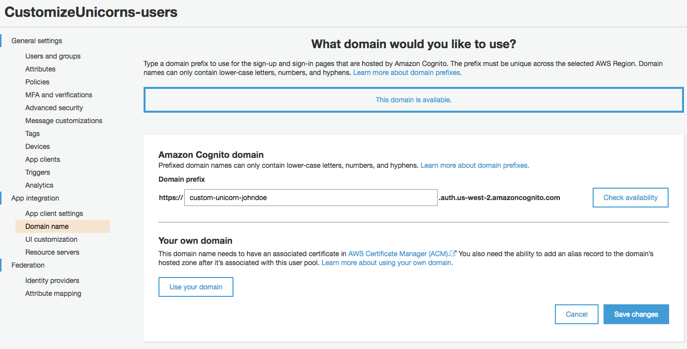

1. 後で利用するので、設定したドメイン名をメモしておきます。(このようなフォーマットになります `https://<your-custom-name>.auth.<aws-region>.amazoncognito.com`)

	**Tip 1**: **アプリの統合** タブに移動すると、完全なドメイン名をコピーできます。
	
	**Tip 2**: 完全なドメイン名をテキストエディタにコピーするか、cloud9 IDE 環境で新しいファイルを作成してメモ帳として使用することもできます。


### <a name="1B"></a>モジュール 1B: Cognito ユーザープールの認証スコープの作成

Amazon Cognito ユーザープールでは、カスタムリソースサーバーを宣言できます。カスタムリソースサーバーには一意の識別子（通常はサーバーURI）があり、カスタム [**スコープ** ](https://www.oauth.com/oauth2-servers/scope/)を宣言できます。スコープを使用すると、アプリへのアクセスを、使用可能なすべての API とリソースのより小さなサブセットに制限できます。

まず、2つのスコープを定義することから始めます。

* **CustomizeUnicorn** - パートナー企業によって利用されます。ユニコーンの衣装のカスタマイズオプションをリストしたり、作成、詳細表示、削除を行うことができます。
* **ManagePartners** - 社内の管理者やアプリが、パートナー企業を登録するために使用します。

次の手順で、これらを設定します:

1. **アプリの統合** にある **リソースサーバー** タブに移動します。

1. リソースサーバの画面で、**リソースサーバーの追加**をクリックします

1. 名前に `WildRydes` を入力します。

1. カスタムリソースサーバーの識別子として `WildRydes` を入力します。

1. スコープのセクションで、２つの新しいスコープを宣言します：
	* Name: `CustomizeUnicorn`  Description: used by 3rd party partners to customize unicorns 
	* Name: `ManagePartners`  Description:  used by internal apps/admin to register partner companies 
	
	**変更の保存** をクリックします。
	
	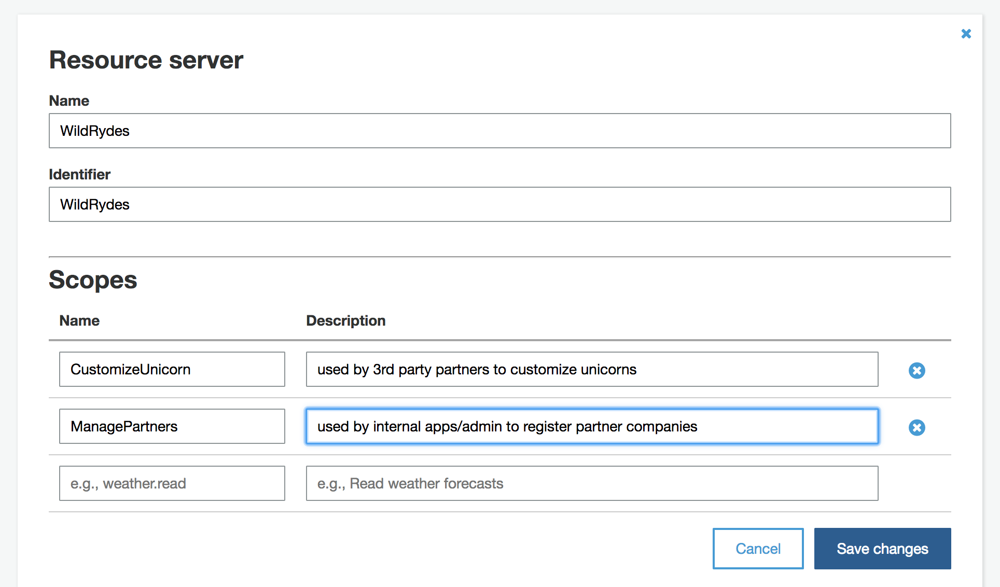

### <a name="1C"></a> モジュール 1C: 内部管理用アカウントのクライアント認証情報の作成

ユニコーンをカスタマイズするためにサインアップする新しい会社には、リクエストで使用できるクライアント認証情報（クライアント ID とクライアントシークレット）のセットを発行する必要があります。つまり、これらのクライアント認証情報を作成して配布するプロセスが必要になります。

実際には、この作業を Web 開発者ポータルで行うことができます。パートナー企業は、何らかのユーザー名とパスワードを使用して Web ポータルにサインインし、クライアント認証情報を要求できるようにすることが可能です。ただし、このワークショップでは時間が限られているので、**POST /partner** API を作成して、Wild Rydes の管理者がパートナー企業のサインアップのために使用できるようします。

それでは、`WildRydes/ManagePartners` の OAuth スコープを持つクライアント管理者用の認証情報を作成して、 パートナー企業のサインアップを開始しましょう！


1. Cognito コンソール画面で、 **全般設定** の **アプリクライアント** タブを選択します。

1. **アプリクライアントの追加** をクリックします。

1. アプリクライアント名として `Admin` を入力します。 ( **Auth Flows Configuration** の項目は, ALLOW_CUSTOM_AUTH と ALLOW_USER_SRP_AUTH のチェックを外すか、そのまま有効でもかまいません) **要確認**

	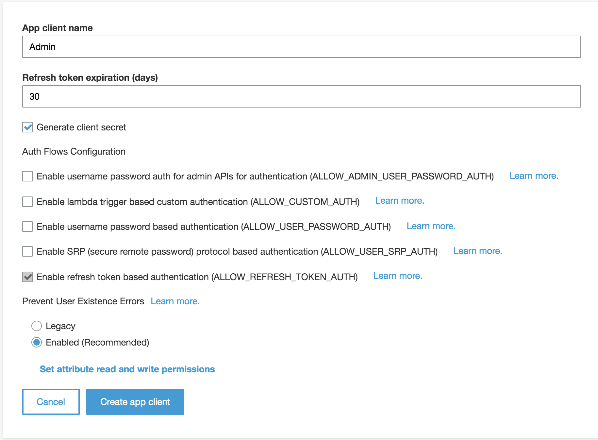

1. **アプリクライアントの作成** をクリックします。

1. クライアント管理者のための **アプリクライアントID** と **アプリクライアントのシークレット** が作成されます。**詳細** をクリックすると両方が確認できるので、この２つをコピーしておいてください（あとで利用します）

	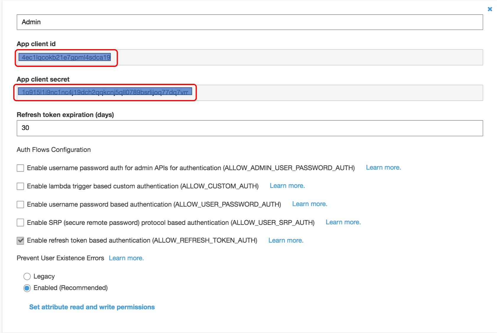

1. **アプリの統合** の **アプリクライアントの設定** へ移動します。

1. 先程作成した管理者のために、許可されている OAuth フローで **Client credentials** を選択し、許可されているカスタムスコープで**WildRydes/ManagePartners**を選択した後、 **変更の保存** をクリックします。

	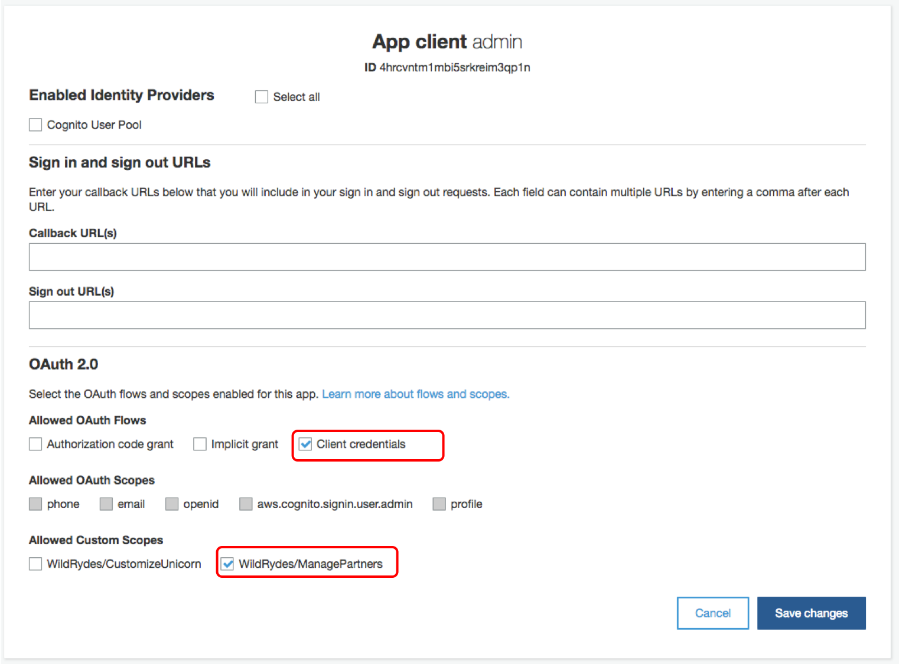
	


### <a name="1D"></a> モジュール 1D: Lambdaカスタムオーソライザーの設定
API Gateway のための [**Lambda オーソライザー**](https://docs.aws.amazon.com/apigateway/latest/developerguide/apigateway-use-lambda-authorizer.html) を設定します。以下の図のように、リクエスト内のアクセストークンを検査し、呼び出し元の ID と対応するアクセスポリシーを決定するために、Lambda 関数が動作します。

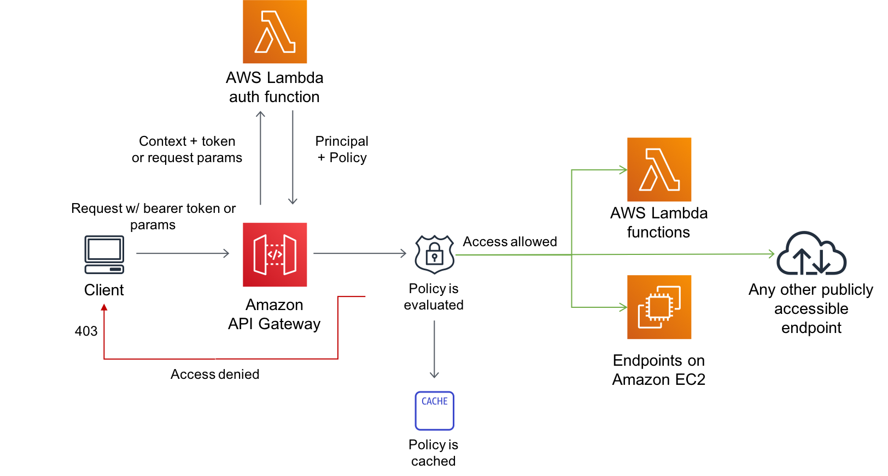

1. Cloud9 IDE 環境のブラウザのタグに戻るか、[Cloud9 コンソール](https://console.aws.amazon.com/cloud9/home)から再度開きます。

1. デプロイしたサーバーレス API には、バックエンドにサードパーティ企業の識別子( MySQL のテーブル`Companies` のプライマリキーと、`Custom_Unicorns` テーブルの外部キーの制約）があります。Lambda 関数がアクセストークンを検査すると、そこから OAuth のクライアント ID がわかります。どの会社がリクエストを行っているかをバックエンドの Lambda 関数に伝えるには、クライアント ID をバックエンドデータベースの会社 ID と付け合わせるルックアップテーブルが必要です。今回は下図のように、DynamoDB テーブルを使用してこのマッピングを管理し、認証機能をバックエンドシステムから分離することを選択しました:

	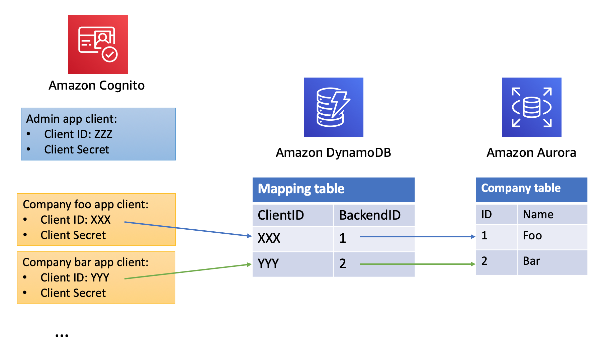

1. このモジュールの準備として、このマッピングを管理するための DynamoDB テーブルもすでにプロビジョニングされています。`template.yaml`の **Resources** セクションで、下記の記述を確認してください。

	```
	  PartnerDDBTable:
	    Type: AWS::Serverless::SimpleTable
	    Properties:
	      PrimaryKey:
	        Name: ClientID
	        Type: String
	      TableName: !Sub '${AWS::StackName}-WildRydePartners'
	
	```

1. 次に、Lambda オーソライザーのコードが必要です！ `src/authorizer` フォルダにあるコードを確認していきます。

	以下は、オーソライザーのコードについての説明です:
	
	* ユーザープールから公開鍵をダウンロード（もしキャッシュされていない場合）
	* JWT トークンをデコードし、公開鍵で署名を検証
	* JWT トークンから解析されたクレームに基づいて、アクセスを許可する API リソースとアクションが指定されたレスポンスポリシーを生成
	
1. `src/authorizer` フォルダに nodejs の依存関係をインストールします。

	```
	cd ~/environment/aws-serverless-security-workshop/src/authorizer
	npm install
	```

1. `template.yaml`の **Resources** セクションに、このオーソライザーの Lambda 関数を追加します。

	```
	  CustomAuthorizerFunction:
	    Type: AWS::Serverless::Function
	    Properties:
	      CodeUri: authorizer/
	      Runtime: nodejs14.x
	      Handler: index.handler
	      Policies:
	        Statement:
	          - Effect: Allow
	            Action:
	            - "dynamodb:*"
	            Resource: "*"
	      Environment:
	        Variables:
	          USER_POOL_ID: !Ref CognitoUserPool
	          PARTNER_DDB_TABLE: !Ref PartnerDDBTable
	```

1. API gateway からこのカスタムオーソライザーを呼び出すための IAM ロールが必要です。SAMテンプレート( `template.yaml` )の **Resources** セクションにさらに下記のリソースを追加します 

	```
	  ApiGatewayAuthorizerRole:
	    Type: AWS::IAM::Role
	    Properties:
	      AssumeRolePolicyDocument:
	        Version: "2012-10-17"
	        Statement:
	          -
	            Effect: "Allow"
	            Principal:
	              Service:
	                - "apigateway.amazonaws.com"
	            Action:
	              - sts:AssumeRole
	      Policies:
	        -
	          PolicyName: "InvokeAuthorizerFunction"
	          PolicyDocument:
	            Version: "2012-10-17"
	            Statement:
	              -
	                Effect: "Allow"
	                Action:
	                  - lambda:InvokeAsync
	                  - lambda:InvokeFunction
	                Resource:
	                  Fn::Sub: ${CustomAuthorizerFunction.Arn}
	```

1. SAM テンプレート( `template.yaml` ) から swaggar の定義を検索し、下記の場所を見つけます。

	```
	  UnicornApi:
	    Type: AWS::Serverless::Api
	    Properties:
	      StageName: dev
	      DefinitionBody:
	        swagger: "2.0"
	        info:
	          title:
	            Ref: AWS::StackName
	          description: My API that uses custom authorizer
	          version: 1.0.0
	        ### TODO: add authorizer
	        paths:
			   ....
	```

1. `### TODO: add authorizer` 部分を、下記に置き換えます。

	```
	        securityDefinitions:
	          CustomAuthorizer:
	            type: apiKey
	            name: Authorization
	            in: header
	            x-amazon-apigateway-authtype: custom
	            x-amazon-apigateway-authorizer:
	              type: token
	              authorizerUri:
	                Fn::Sub: arn:aws:apigateway:${AWS::Region}:lambda:path/2015-03-31/functions/${CustomAuthorizerFunction.Arn}/invocations
	              authorizerCredentials:
	                Fn::Sub: ${ApiGatewayAuthorizerRole.Arn}
	              authorizerResultTtlInSeconds: 60

	```
	
	**注意:** 置き換えた `securityDefinitions` の部分は、`info` や `paths` と同じインデントにそろえてください。

1. `paths` セクションの **全ての** コメント部分(#)を削除し、コメントを外します。

	```
	#              security:
	#                - CustomAuthorizer: []
	```

	コメントを外した後は、下記のように行頭のインデントをそろえてください。

	変更前:
	
	```
	          "/socks":
	            get:
	#              security:
	#                - CustomAuthorizer: []
	              x-amazon-apigateway-integration:
	                httpMethod: POST
	                type: aws_proxy
	                uri:
	                  Fn::Sub: arn:aws:apigateway:${AWS::Region}:lambda:path/2015-03-31/functions/${UnicornPartsFunction.Arn}/invocations
	              responses: {}
				...
	```
	
	変更後:
	
	```
	        paths:
	          "/socks":
	            get:
	              security:
	                - CustomAuthorizer: []
	              x-amazon-apigateway-integration:
	                httpMethod: POST
	                type: aws_proxy
	                uri:
	                  Fn::Sub: arn:aws:apigateway:${AWS::Region}:lambda:path/2015-03-31/functions/${UnicornPartsFunction.Arn}/invocations
	              responses: {}
				...
	```
1. `template.yaml` を保存します。
1. 正しくテンプレートを編集できたかを評価します。

	まず、下記のコマンドで 'src' フォルダに戻ります。
	
	```
	cd ..
	
	```
	
	そして、下記を実行します。
	

	```
	sam validate -t template.yaml
	```
	
	もし、SAM テンプレート( `template.yaml` ) にエラーがなければ、下記が表示されます。
	
	```
	2018-10-08 16:00:56 Starting new HTTPS connection (1): iam.amazonaws.com
	<your directory>/src/template.yaml is a valid SAM Template
	```
	
	エラーが表示された場合は、エラー内容にしたがってその箇所を修正してください。

1.  モジュール 0 で実行した同じコマンドでアプリケーションをデプロイし、プログラムを更新します。

	```
	 aws cloudformation package --output-template-file packaged.yaml --template-file template.yaml --s3-bucket $BUCKET --s3-prefix securityworkshop --region $REGION &&  aws cloudformation deploy --template-file packaged.yaml --stack-name CustomizeUnicorns --region $REGION --capabilities CAPABILITY_IAM --parameter-overrides InitResourceStack=Secure-Serverless
	```

1. 更新が終了したら、[API Gateway コンソール](https://console.aws.amazon.com/apigateway) に移動し、いま更新した API(CustomizeUnicorns) をクリックします。**リソース** の配下にある任意のメソッドを選択すると、**メソッドリクエスト** の下に **認可:CustomAuthorizer** と設定されているのが確認できます。

	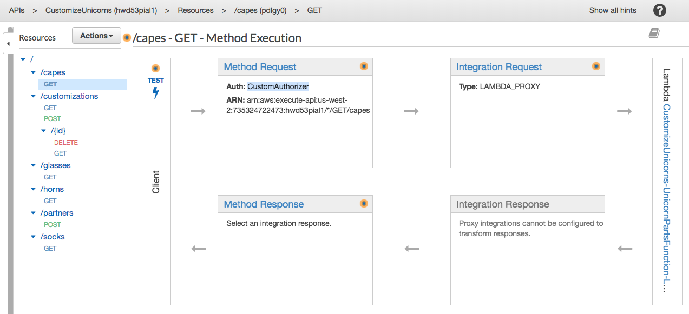

1. Postman に戻り、（コレクション内の任意の API に対して）リクエストの送信テストします。ここでは、APIから **401 Unauthorized** エラーが発生するはずです。

	> 時間があれば、全てのAPIで試してみてください。


### <a name="1E"></a>モジュール 1E: 管理クライアントを使用して新しいパートナー企業の登録

これで、認証されたリクエストのみが保護されたリソースに到達できるように API を設定しました。次のステップは、認証リクエストを行うための認証情報を取得することです！

モジュール 1C で作成した管理クライアントの認証情報を使用して、PostMan で認証されたリクエストを行います

1. Postman で、左ペインの Customize_unicornsフォルダを展開し、**Manage Partner** フォルダをクリックします。
1. **Authorization** タブから **TYPE** を `OAuth 2.0` に変更し、 **Get New Access Token** をクリックします。

	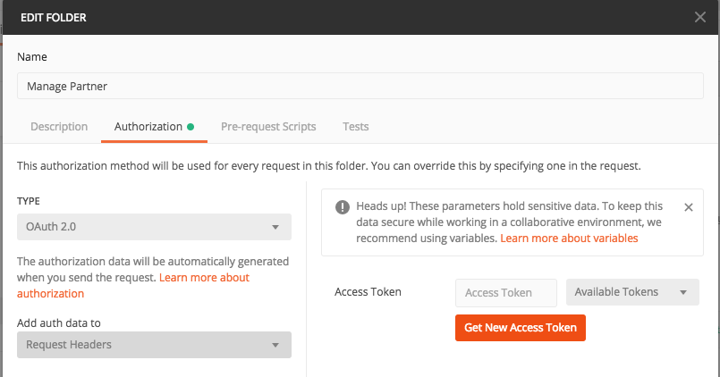

1. トークンリクエストを設定します:
	
	* **Name**: `admin`
	
	* **Grant Type**: `Client Credentials`
	* **Access Token URL**: [モジュール 1A](#1A)で作成したCognitoドメインを覚えていますか？ `/oauth2/token` を後ろに追加して入力します。

		> 設定値はこのようになります `https://custom-unicorn-johndoe.auth.us-west-2.amazoncognito.com/oauth2/token`
	
	* **Client ID**: モジュール1Dで作成した admin の クライアントID
	* **Client Secret**:  モジュール1Dで作成した admin の クライアントシークレット
	* **Scope**: 空白（オプションです）
	

	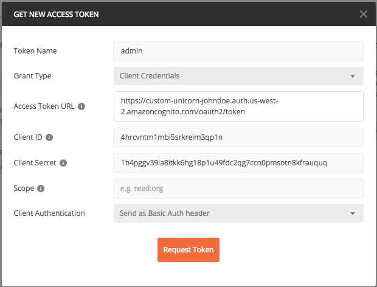
	

**Request Token** をクリックします。
1. これで、Cognito から返された新しいトークンが表示されます。下にスクロールして **Use Token** をクリックします。

1. Edit Folder ウィンドウに戻り、**update** をクリックします。

1. ツールバーの左にある **Manage Partner** フォルダの **POST Create Partner** API に移動します。

1. **Body** タブに登録したいパートナー企業の名前を入力し、**Send** をクリックします。 ClientID と Secret がレスポンスとして入手できるはずです。

	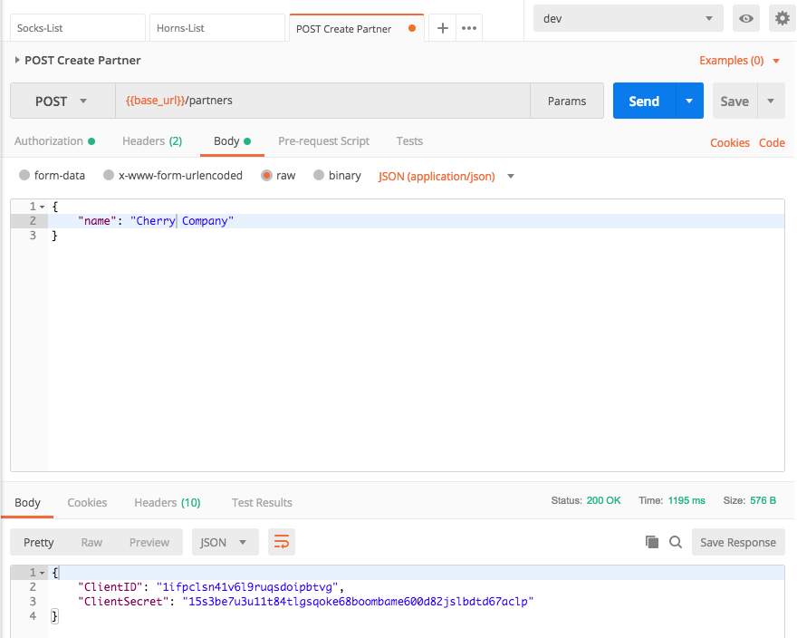
	
1. `ClientId` と `ClientSecret` をメモしておいてください。これは「Cherry Corp」 が、ユニコーンのカスタマイズする際に使用するクライアントの認証情報です！

### <a name="1F"></a>モジュール 1F: パートナー企業のクライアント認証情報を使用したユニコーンのカスタマイズ

これで、登録したパートナー企業のクライアント認証情報のセットができました。"Cherry Corp"（またはあなたが登録した会社）のふりをして、ユニコーンのカスタマイズを提出してみましょう！


1. 作成したばかりの新しい会社のクライアント認証情報でアクセストークンをリクエストします。（これは[モジュール 1E](#1E)の手順とよく似ています）

	1. **Customize_Unicorns** コレクションを右クリックして **edit** をクリックします。

		> サブフォルダではなく、全体の **Customize_Unicorns** コレクションを右クリックしてください。そうすると、サブフォルダによってオーバーライドされない限り（モジュール1Eで行ったように）、コレクション内の API に使用するデフォルトの認証ヘッダーが設定されます
		
	1. **Authorization** タブに移動し、OAuth2.0 を選択します。
	1. 同じ CognitoトークンURL を使用します (ヒント: Cognito ドメイン + `/oauth2/token`)
	1. [モジュール 1E](#1E)の **POST /partner** APIで生成した Client ID を使用します

		> Tip: もし Client ID や Secretを忘れたら、Congnito ユーザプールのコンソールの **全般設定** - **アプリクライアント** で確認することができます。
	
		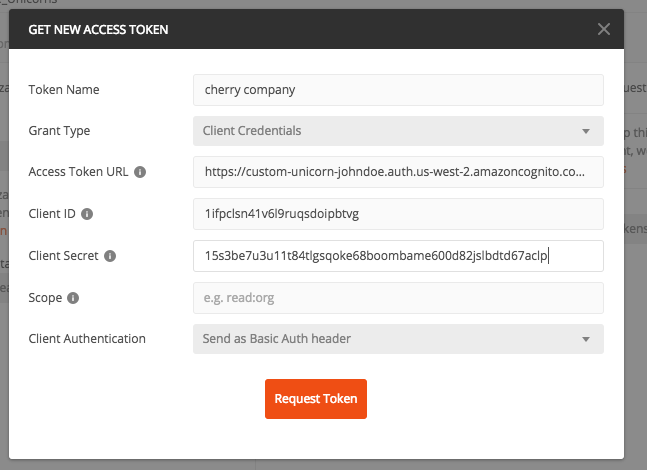

1. ソックスのカスタマイズオプションを表示するリクエストを送信してテストします。今回は成功するはずです！

1. これで、あなたはユニコーンのカスタマイズを作成することがでるようになりました！ コレクションから **POST create Custom_Unicorn** API を選択し、**Body** タブで次のように入力します。

	```javascript
	{  
	   "name":"Cherry-themed unicorn",
	   "imageUrl":"https://en.wikipedia.org/wiki/Cherry#/media/File:Cherry_Stella444.jpg",
	   "sock":"1",
	   "horn":"2",
	   "glasses":"3",
	   "cape":"4"
	}
	```
	
	成功すると、カスタマイズ ID を含んだレスポンスが得られるはずです。
	
	`{ "customUnicornId": X}`

	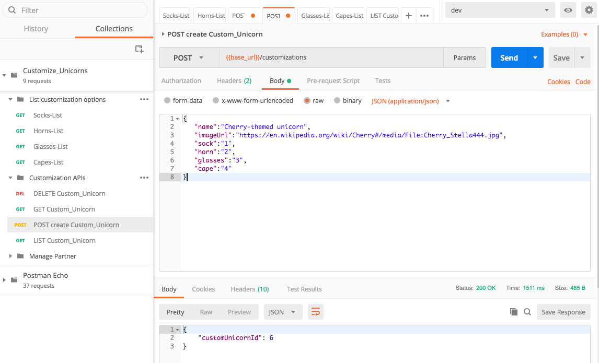
	
1. コレクションの他の API もテストできます。（ユニコーンのカスタマイズの LIST、GET、DEL など）


## 次のステップ

モジュール 1 を完了しサーバレスアプリケーションに認証機能を追加しました。  
ワークショップの[トップページ](../../README.md) に戻り、他のモジュールを続けてください。
