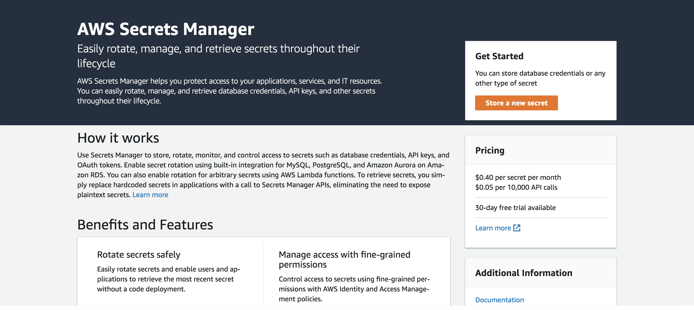
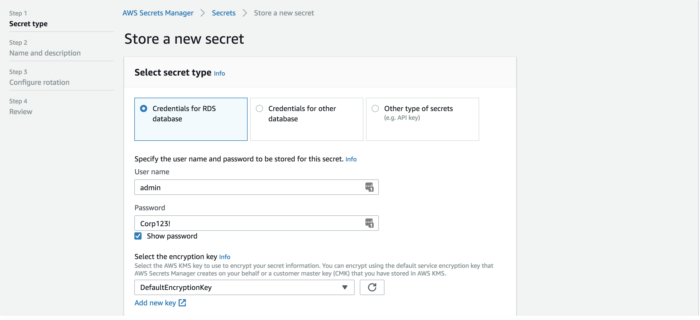
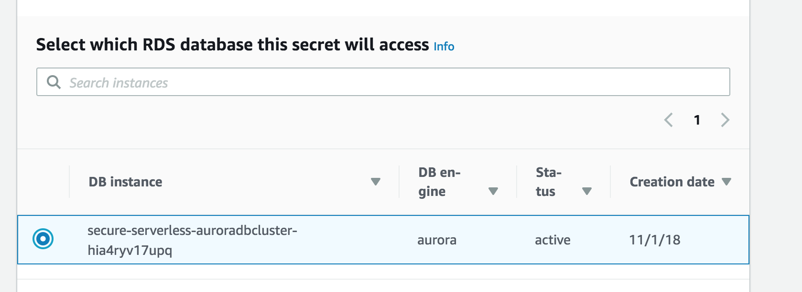
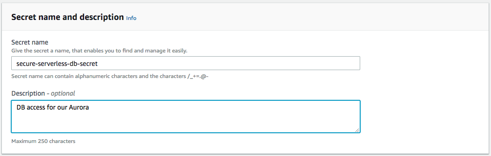
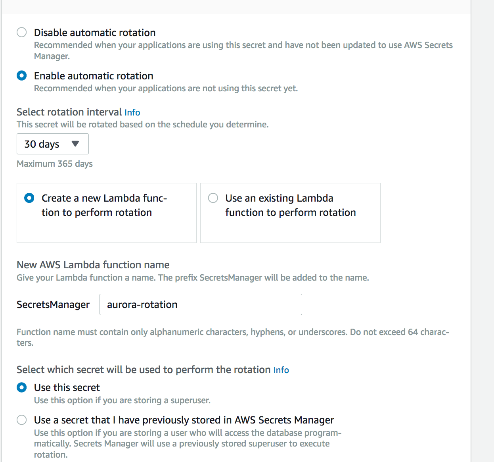
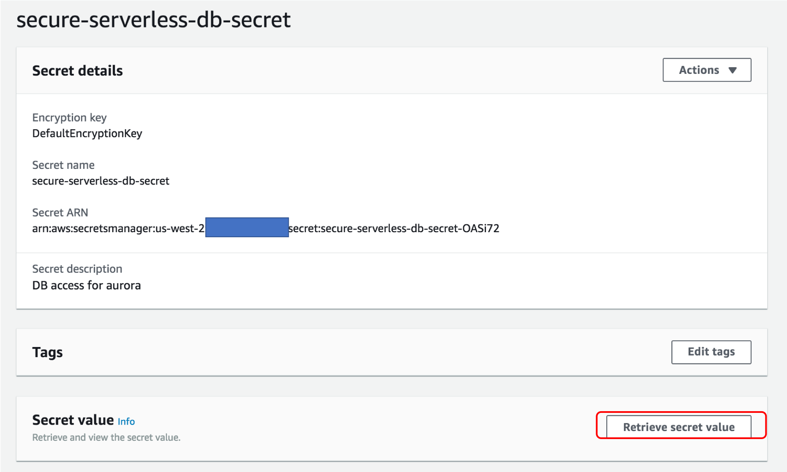
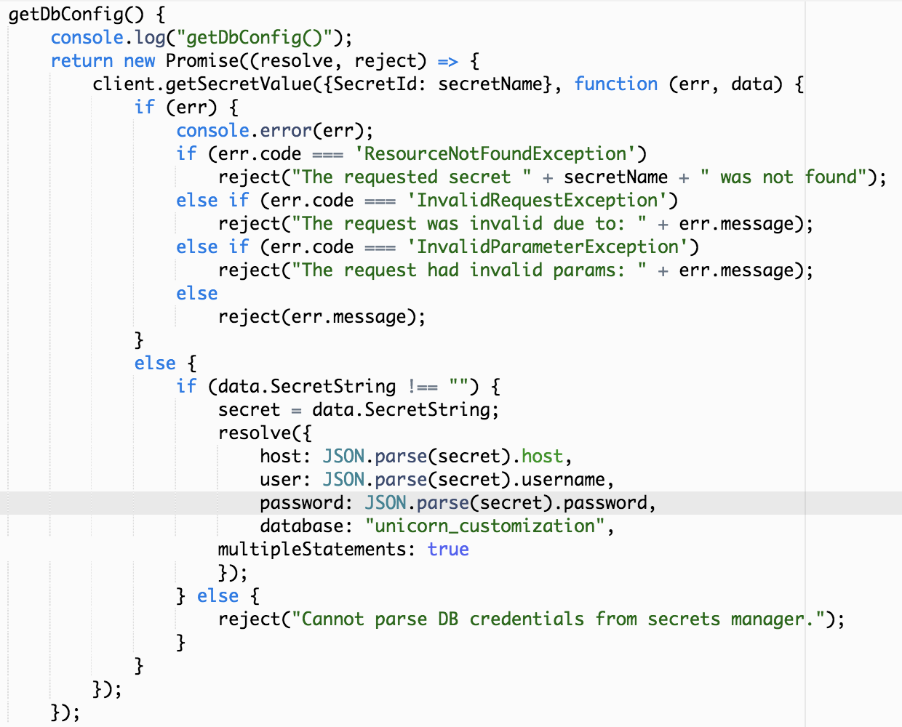

# モジュール 2: AWS Secrets Managerでデータベースのクレデンシャルを安全に保存する

データベースの資格情報や接続情報をハードコーディングすることは、ベストプラクティスではありません。セキュリティの観点からだけでなく、運用上の問題もあります。コード内に機密情報を置くことは、ビジネス上の重要なデータを漏洩させる可能性があります。また、幅広い人がアクセスできる公開リポジトリやプライベートリポジトリにコードをチェックインした場合、誤って情報を公開してしまうリスクもあります。

また運用の観点では、CI/CD パイプラインのステージ間でコードをデプロイする場合、ハードコードされた値は手動作業が必要となるケースが多く、開発プロセスを遅くしてしまう可能性もあります。

このセクションでは、AWS Secrets Manager を使ってデータベースの認証情報を処理していきます。AWS Secrets Managerは、コードを読まれたとしてもデータベースを安全に保つことも、RDS と統合してパスワードを自動的にローテーション処理することもできます。

> このモジュールを実行した場合、このアプリケーションでローカルテストするための権限が無効になるため、Cloud9 環境でのローカル テストができなくなります。

## モジュール 2A: Secrets Manager で シークレットを作成する

それでは、Secrets Managerで シークレットを設定していきます。

1. AWS コンソールから AWS Secrets Manager に移動します
	
1. *新しいシークレット保存する*をクリックします
2. ***RDSデータベースの認証情報*** を選択し、以下の値を入力します
	- ユーザ名: `admin`
	- パスワード: `Corp123!`
	- 暗号化キーを選択してください: `DefaultEncryptionKey`.
	
	- このシークレットがアクセスするRDSデータベース:  `secure-serverless-aurora`で始まるものを選択
	
		
	
1. *次*をクリックし、以下の値を入力します
	
	- シークレットの名前: `secure-serverless-db-secret`
	- オプションの説明: DB access for our Aurora.
	
1. *次*をクリックし、ローテーションを設定します
	
	- `自動ローテーションを有効にする`をクリックします
	- ローテーション間隔として`30 日`を選択
	- **ローテーションを実行するための新しいLambda 関数を作成します**を選択
	- 新しい Lambda 関数名: `aurora-rotation`
	- **このシークレットを使う** を選択
	
1. *次*をクリックし、 サンプルコードを確認してください。次のセクションで、Secrets Manager を使用するようにコードを修正するので、このコードを例として使用します。
1. 最後に *保存* をクリックします

> FirefoxやChromeの拡張機能を使用している場合は注意してください。*LastPass*のような拡張機能の中には、以前に入力した値を変更してしまうものがあります。
> 
> シークレットを作成した後、 **シークレットの値を取得する**  をクリックして値を確認することができます。
> 
> 

## モジュール 2B: Lambda 関数に Secrets Manager の読取り権限を与える

 Lambda 関数の実行ポリシーを変更して、Secrets Manager への API 呼び出しを許可します。

`src/template.yaml`の以下のブロックで、Secrets Manager のポリシーを定義しているブロックを探して、コメントを外してください。 (**全部で 3 箇所あります。すべてコメントを外して下さい**　)

```yaml
#        - Version: '2012-10-17'
#          Statement:
#            - Effect: Allow
#              Action:
#                - "secretsmanager:GetSecretValue"
#              Resource: "*"

```


&#9888; **注意: 必ず３箇所を修正したことを確認してください！**  &#9888;  

次に、**Globals**のセクションの中で、*SECRET_NAME* という環境変数を指定していることを確認してください。

```
Globals:
  Function:
    Timeout: 30
    Environment:
      Variables:
        SECRET_NAME: secure-serverless-db-secret # name of the RDS credentials in secrets manager

```

## モジュール 2C: シークレットを使用するようにコードを修正する

シークレットを作成したら、Secrets Managerを使用するようにアプリケーションコードを修正していきます。ファイル `src/app/dbUtils.js` に移動します。ここには接続情報が含まれています。

ファイルの先頭に、AWS Secrets Manager を使用するための変数を作成します。
`const PARTNER_COMPANY_TABLE = "Companies";`の行の直後に、以下を追加します。

```javascript
// Load the AWS SDK
const AWS = require('aws-sdk');
const secretName = process.env.SECRET_NAME;
var secret;

// Create a Secrets Manager client
const client = new AWS.SecretsManager();
```

このコードを見ると、環境変数を使用していることに気づくかもしれません。これは先程のステップで確認した`template.yaml` で *Global* セクションで定義されています。

それでは、データベースへの接続方法を変更してみましょう。これを行うメソッドは、*dbUtils.js*内の**getDbConfig**と呼ばれています。
このメソッドは、JSONで以下のような値を返します。

```javascript
            resolve({
                host: host,
                user: "admin",
                password: "Corp123!",
                database: "unicorn_customization",
                multipleStatements: true
            });

```

上記の行を以下のコードに置き換えてください。
※resolve(....); の要素をすべて置き換えます。

```javascript
            client.getSecretValue({SecretId: secretName}, function (err, data) {
                if (err) {
                    console.error(err);
                    if (err.code === 'ResourceNotFoundException')
                        reject("The requested secret " + secretName + " was not found");
                    else if (err.code === 'InvalidRequestException')
                        reject("The request was invalid due to: " + err.message);
                    else if (err.code === 'InvalidParameterException')
                        reject("The request had invalid params: " + err.message);
                    else
                        reject(err.message);
                }
                else {
                    if (data.SecretString !== "") {
                        secret = data.SecretString;
                        resolve({
                            host: JSON.parse(secret).host,
                            user: JSON.parse(secret).username,
                            password: JSON.parse(secret).password,
                            database: "unicorn_customization",
	                    multipleStatements: true
                        });
                    } else {
                        reject("Cannot parse DB credentials from secrets manager.");
                    }
                }
            });

```
変更後は下記のようになります。




もし時間があればこのコードをゆっくり眺めて、AWS Secrets Manager からシークレットを取得して、そのシークレットの値を返していることを確認してください。

## モジュール 2D: デプロイとテスト

それでは、この変更をデプロイしてアプリケーションをテストしていきます。

1. 以下を実行してテンプレートを検証します。

	```
	sam validate -t template.yaml
	```
	
1.  以下を実行して変更をデプロイします。

	```
	 aws cloudformation package --output-template-file packaged.yaml --template-file template.yaml --s3-bucket $BUCKET --s3-prefix securityworkshop --region $REGION &&  aws cloudformation deploy --template-file packaged.yaml --stack-name CustomizeUnicorns --region $REGION --capabilities CAPABILITY_IAM --parameter-overrides InitResourceStack=Secure-Serverless
	```

1. postmanで API をテストします。API 内の `/socks`, `/horns`... などで動作が正常に行われることを確認してください。

## 補足

**シークレットのキャッシュ**
現在のコードでは、Lambda 関数が呼び出されるたびに Secrets Manager を呼び出してシークレットを取得しています。これは、API が頻繁に呼び出されている場合、Secrets Manager への API コールを大量に発生させる可能性があります。
Secrets Manager へのトラフィックを減らすために、[実行コンテキストの再利用](https://aws.amazon.com/blogs/compute/container-reuse-in-lambda/)を活用し、シークレットの値をキャッシュすることもできます。

## 次のステップ

ワークショップの[トップページ](../../README.md) に戻り、他のモジュールを続けてください。
