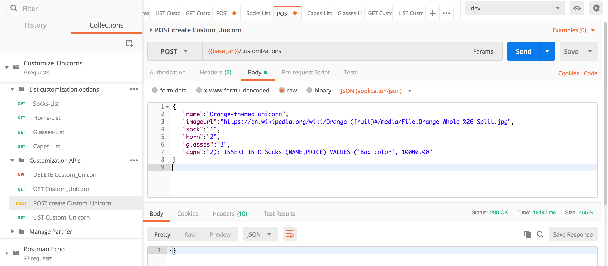
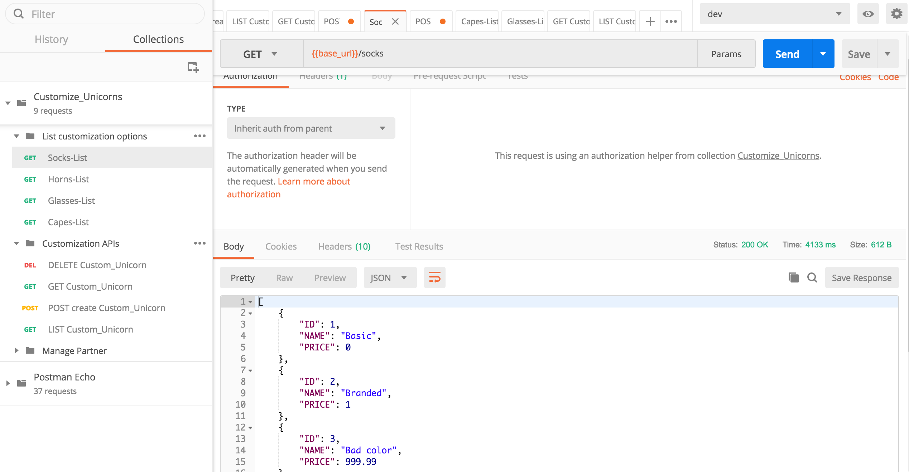
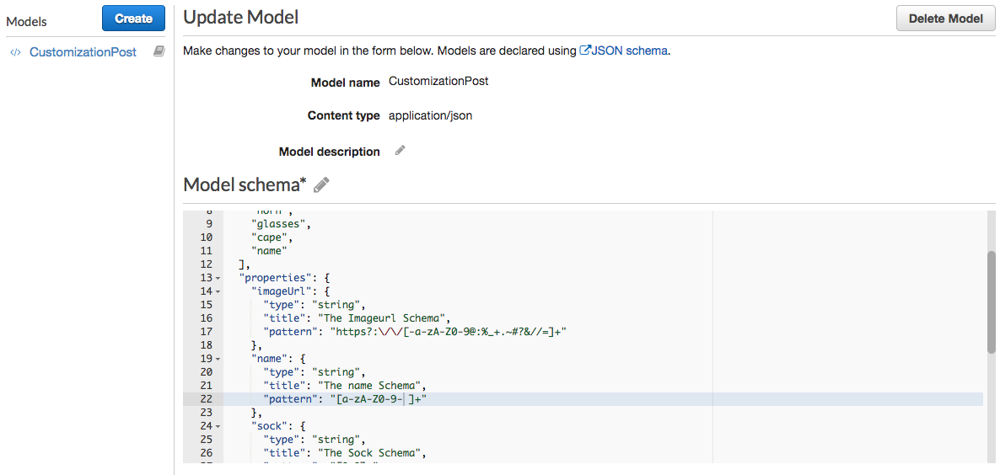
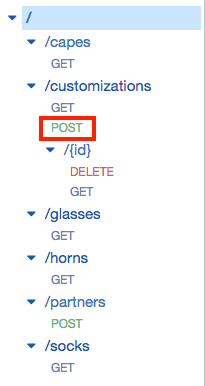
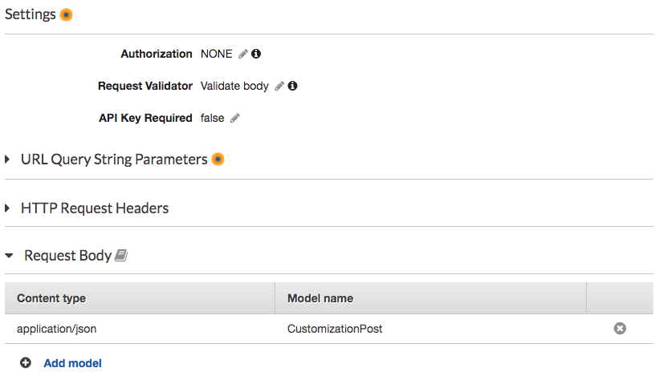

# モジュール 3: API Gateway の入力値チェック

OWASP サイトにこんな記述があります。

> "*Webアプリケーションのセキュリティ上の最も一般的な弱点は、クライアントからの入力を適切に検証できないことです*."
> 
>  --- [**OWASP** (The Open Web Application Security Project)](https://www.owasp.org/index.php/Data_Validation)

[XKCD コミック](https://xkcd.com/327/) にもこの点をよく示した４コマ漫画があります。 


API Gateway を設定して、統合リクエストを処理する前に、APIへのリクエストの内容を検証することができます。もし検証に失敗した場合、API Gateway は呼び出し元に400 エラー応答を返し、検証結果をCloudWatch Logsに保存します。これにより、バックエンドへの不要な呼び出しを減らすことができ、アプリケーションの検証作業に集中できるようになります。


例えば、このアプリケーションでは、カスタマイズのリクエストを受け取った場合、カスタマイズの内容が正しいものであるかを確認する必要があります。

 - カスタムオブジェクトの **name(名前)**
 - cape(マント)の **image** の url  
 - id で指定された **socks(靴下)** のタイプ
 - 使用する **horn(角)** の id
 - **glasses(眼鏡)** の id
 - id で指定された **cape(マント)** のタイプ

これらの情報は、正しくカスタマイズを行うために、リクエスト Body に記載されている必要があります。
例えば、imageUrl は有効な URL でなければならないし、靴下や角の id は数値でなければなりません。

API Gateway の検証機能を活用することで、必要なパラメータと、各パラメータが遵守すべき正規表現パターンを強制することができます。これにより、バックエンドのコードから検査のためのロジックを削減でき、ビジネスロジックとより深い検証に集中することができます。

## オプション: API に対して SQL インジェクションを行う

もし **モジュール 6: WAF** をまだ実施していなければ、このサーバーレスアプリケーションは、SQL インジェクション攻撃の脆弱性があります。このオプションでは、攻撃を実行する方法を示します。


<details>
<summary><strong>クリックするとオプションの手順が表示されます </strong></summary>
Lambda 関数のコードを確認すると、入力値の検証は行われておらず、以下の行が mysql クライアント設定の一部として指定されています (`/src/app/dbUtils.js` の下にあります)。 

```
                multipleStatements: true

```

> **Note**: ベストプラクティスとして、コードの中で `multipleStatements` オプションを false に設定するべきです (nodejs mysql クライアントのデフォルトは false )。しかし、すべてのプログラミング言語/ライブラリでデフォルトでは無効になっているわけではないので、この攻撃の簡単さを見てもらうために、今回有効になっています。

SQLクエリをリクエストに埋め込んで簡単に実行することができます。例えば、**POST /customizations** APIのbody を以下のようにしてみてください。

<details>
<summary><strong> モジュール1が完了済みの場合、以下を利用してください </strong></summary>

```
{  
   "name":"Orange-themed unicorn",
   "imageUrl":"https://en.wikipedia.org/wiki/Orange_(fruit)#/media/File:Orange-Whole-%26-Split.jpg",
   "sock":"1",
   "horn":"2",
   "glasses":"3",
   "cape":"2); INSERT INTO Socks (NAME,PRICE) VALUES ('Bad color', 10000.00"
}
```

</details>

<details>
<summary><strong>モジュール1を完了している場合、以下を利用してください </strong></summary>

```
{  
   "name":"Orange-themed unicorn",
   "imageUrl":"https://en.wikipedia.org/wiki/Orange_(fruit)#/media/File:Orange-Whole-%26-Split.jpg",
   "sock":"1",
   "horn":"2",
   "glasses":"3",
   "cape":"2); INSERT INTO Socks (NAME,PRICE) VALUES ('Bad color', 10000.00",
   "company":"1"
}
```

</details>




Postmanを使ってリクエストを送信してください。リクエストが成功した場合、SQLインジェクション攻撃を実行したことになります！

先ほど実行したSQLインジェクションのクエリを見ると、**GET /socks** に対して  `Socks`テーブルに不正な値を追加していることがわかります



</details>

## モジュール 3A:  カスタマイズのためのモデルを作成する

API Gatewayでは、[**モデル**](https://docs.aws.amazon.com/apigateway/latest/developerguide/models-mappings.html#models-mappings-models)を用いてペイロードのデータ構造を[JSONスキーマドラフト4](https://tools.ietf.org/html/draft-zyp-json-schema-04)で定義することができます。

モデルを定義すると、受信するパラメータが期待通りの形式であることを確認でき、さらに、それらを正規表現と照合することもできます。また、あなたの正規表現が正しいかをテストできる [regexr.com](https://regexr.com/)というサイトもあります。

**POST /customizations** APIでは、以下のモデルを使用します。

```json
{
  "title": "Customizations",
  "$schema": "http://json-schema.org/draft-04/schema#",
  "type": "object",
  "required": [
    "imageUrl",
    "sock",
    "horn",
    "glasses",
    "cape",
    "name"
  ],
  "properties": {
    "imageUrl": {
      "type": "string",
      "title": "The Imageurl Schema",
      "pattern": "^https?:\/\/[-a-zA-Z0-9@:%_+.~#?&//=]+$"
    },
    "name": {
      "type": "string",
      "title": "The name Schema",
      "pattern": "^[a-zA-Z0-9- ]+$"
    },
    "sock": {
      "type": "string",
      "title": "The Sock Schema",
      "pattern": "^[0-9]*$"
    },
    "horn": {
      "type": "string",
      "title": "The Horn Schema",
      "pattern": "^[0-9]*$"
    },
    "glasses": {
      "type": "string",
      "title": "The Glasses Schema",
      "pattern": "^[0-9]*$"
    },
    "cape": {
      "type": "string",
      "title": "The Cape Schema",
      "pattern": "^[0-9]*$"
    }
  }
}
```

以下の手順に従ってください。

1. API Gateway コンソールへ移動する
2. **CustomizeUnicorns** の APIをクリック
3. **Models** をクリック
4. **Create** をクリックし、次の値でモデルを作成します
	
	- Model name: `CustomizationPost`
	- Content type: `application/json`
1. モデルスキーマは、先ほど掲示した *json* を使用します
1.  **Create model**をクリックします
	
	

モデルを作成した後、customizations/postメソッドに適用します。

1. API Gateway コンソールで、 CustomizeUnicornsの**Resources** をクリックします

1. /customizations の **POST** メソッドをクリックします

	
	
1. **Method Request**をクリックします

1. **Request Validator**の下の鉛筆マークをクリックします。 **Validate Body** を選択し、tick をクリックして確認します

1. **Request Body** の **Add model** をクリックし、以下の値を入力します
	
	- Content type: `application/json`
	- Model name: `CustomizationPost`
	
1. tick をクリックして確認します

	
	
	> リクエスト Body に加えて、クエリパラメータやリクエストヘッダも検証できることにお気づきでしょうか。これは、アプリケーションが両方を使用しており複雑な検証をしたい場合にとても便利です。より詳しい情報を知りたい場合は[このドキュメント](https://docs.aws.amazon.com/apigateway/latest/developerguide/api-gateway-method-request-validation.html) を参照してください。

	1. 最後にこの設定変更をデプロイします。メニューの**Actions**から**Deploy API**をクリックしてください。**デプロイステージとして `dev` を選択**し、**Deploy**をクリックしてください。

## Module 3B: 検証のテスト

postman を使用して、不正なパラメータを **POST /customizations** API へのリクエストを行ってみて、入力の検証をテストすることができます。(もし不正なエラーメッセージが表示された場合は、認証トークンの有効期限が切れている可能性があります。[モジュール 1](../01-add-authentication/README.md#1E) の手順でこのトークンを更新することができます。

### 不正なパラメータを送信する

検証に失敗するリクエスト Body の例をいくつか紹介します。

* フィールドが欠けている: 

	```javascript
	{  
	   "name":"Cherry-themed unicorn",
	   "imageUrl":"https://en.wikipedia.org/wiki/Cherry#/media/File:Cherry_Stella444.jpg",
	   "glasses": "3",
	   "cape": "4"
	}
	```

* `imageUrl` のURLが無効 

	```javascript
	{  
	   "name":"Cherry-themed unicorn",
	   "imageUrl":"htt://en.wikipedia.org/wiki/Cherry#/media/File:Cherry_Stella444.jpg",
	   "sock": "1" ,
	   "horn": "2" ,
	   "glasses": "3",
	   "cape": "4"
	}
	```

* パラメータ `cape ` が数値ではない (SQL インジェクション)

	```javascript
	{  
	   "name":"Orange-themed unicorn",
	   "imageUrl":"https://en.wikipedia.org/wiki/Orange_(fruit)#/media/File:Orange-Whole-%26-Split.jpg",
	   "sock": "1",
	   "horn": "2",
	   "glasses": "3",
	   "cape":"2); INSERT INTO Socks (NAME,PRICE) VALUES ('Bad color', 10000.00"
	}

	```


レスポンスとして 400 Bad Requestが返ってくるはずです。

```javascript
{"message": "Invalid request body"}
```


### 正しいパラメータを送信する

正しいパラメータで **POST /customizations** API をテストします。

<details>
<summary><strong> モジュール1が完了済みの場合、以下を利用してください </strong></summary>

```javascript
{  
   "name":"Cherry-themed unicorn",
   "imageUrl":"https://en.wikipedia.org/wiki/Cherry#/media/File:Cherry_Stella444.jpg",
   "sock": "1",
   "horn": "2",
   "glasses": "3",
   "cape": "4"
}
```
</details> 

<details>
<summary><strong> モジュール1をまだ完了していない場合、以下を利用してください </strong></summary>

```javascript
{  
   "name":"Cherry-themed unicorn",
   "imageUrl":"https://en.wikipedia.org/wiki/Cherry#/media/File:Cherry_Stella444.jpg",
   "sock": "1",
   "horn": "2",
   "glasses": "3",
   "cape": "4",
   "company" : "1"
}
```
</details> 


下記のような正しいレスポンスが返ってくるはずです。

```bash
{"customUnicornId":<the-id-of-the-customization>}
```

## 入力値のさらなるチェック

これまで見てきたように、API Gatewayの入力値の検証では、型チェックや正規表現のマッチングなどの機能を利用できます。 ただし本番環境のアプリケーションでは、これだけでは十分ではないことが多く、API入力に追加の制約が必要かもしれません。

さらなる保護を得るためには、API Gatewayの入力検証機能に加えて、以下の機能を利用することを検討してください。

* AWS WAF を API Gateway に追加する - [**モジュール 6**](../06-waf/)
* Lambda 関数のコード自体にさらに入力検証ロジックを追加する


## オプション: 他のメソッドへの適用

このアプリケーションには、入力値の検証が必要なメソッドが（少なくとも）もう一つあります。そのメソッド用に json スキーマを作成し、同じ手順で適用すれば、これらのメソッドも安全にできるはずです。時間があればトライしてみてください。

<details>
<summary><strong>ヒント：行き詰った場合はこのモデルを使ってください</strong></summary>

```json
{
  "title": "PartnerPOST",
  "$schema": "http://json-schema.org/draft-04/schema#",
  "type": "object",
  "required": [
    "name"
  ],
  "properties": {
    "name": {
      "type": "string",
      "title": "Partner Schema",
      "pattern": "^[a-zA-Z0-9- ]+$"
    }
  }
}
```
</details>

## 次のステップ
これで入力値チェックの基本機能が API に追加され、不正な入力によって妨害されるリスクがさらに軽減されました！

ワークショップの [トップページ](../../README.md) に戻り、次のモジュールを選択してください。