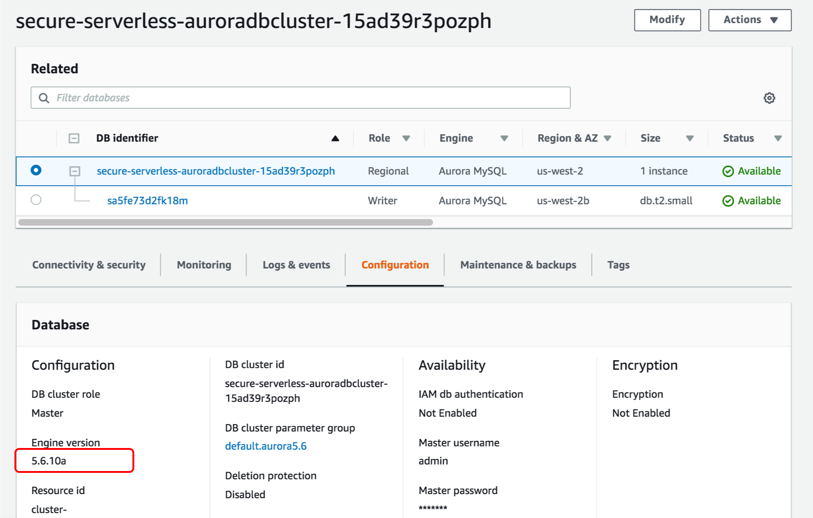

# モジュール 4: SSLを利用したDB接続の暗号化

現在の構成は VPC を使用しているので、トラフィックはプライベートな経路で通信が行われますが、規制やコンプライアンスの要件によっては、通信の暗号化が必要になる場合があります。この暗号化は、データベースと通信する際にデータを保護することができます。

*dbUtils.js* を開き、データベース接続に新しいプロパティを追加します。 メソッド ***getDbConfig*** の箇所の resolve オブジェクト ( JSON オブジェクト) の中に新しい行を追加します。

```
    ssl: "Amazon RDS",
```
resolve オブジェクトは下記のようになります。

<details>
<summary><strong> モジュール2(AWS Secrets Manager設定)を行ってない場合 </strong></summary><p>

```javascript
			resolve({
			    ssl: "Amazon RDS",
			    host: host,
			    user: "admin",
			    password: "Corp123!",
			    database: "unicorn_customization",
			    multipleStatements: true
			});
```
</details>

<details>
<summary><strong>モジュール2(AWS Secrets Manager設定)を行った場合</strong></summary><p>

```javascript
            client.getSecretValue({SecretId: secretName}, function (err, data) {
                if (err) {
                    console.error(err);
                    if (err.code === 'ResourceNotFoundException')
                        reject("The requested secret " + secretName + " was not found");
                    else if (err.code === 'InvalidRequestException')
                        reject("The request was invalid due to: " + err.message);
                    else if (err.code === 'InvalidParameterException')
                        reject("The request had invalid params: " + err.message);
                    else
                        reject(err.message);
                }
                else {
                    if (data.SecretString !== "") {
                        secret = data.SecretString;
                        resolve({
                            ssl: "Amazon RDS",
                            host: JSON.parse(secret).host,
                            user: JSON.parse(secret).username,
                            password: JSON.parse(secret).password,
                            database: "unicorn_customization",
                            multipleStatements: true
                        });
                    } else {
                        reject("Cannot parse DB credentials from secrets manager.");
                    }
                }
            });
```
</details>

最後に、この変更をデプロイします。

```bash
cd ~/environment/aws-serverless-security-workshop/src
aws cloudformation package --output-template-file packaged.yaml --template-file template.yaml --s3-bucket $BUCKET --s3-prefix securityworkshop --region $REGION &&  aws cloudformation deploy --template-file packaged.yaml --stack-name CustomizeUnicorns --region $REGION --capabilities CAPABILITY_IAM --parameter-overrides InitResourceStack=Secure-Serverless
```

デプロイが完了すると、データベース接続が SSL で暗号化されるようになります。

## オプション: SSL接続を必須にする

特定のユーザアカウントに対して、SSL接続を必須にすることもできます。例えば、MySQL のバージョンに応じて、以下のステートメントのを使用して、 `encrypted_user`ユーザアカウントに SSL 接続を要求することができます。

MySQL 5\.7 以降:

```
ALTER USER 'encrypted_user'@'%' REQUIRE SSL;            
```

MySQL 5\.6 以前:

```
GRANT USAGE ON *.* TO 'encrypted_user'@'%' REQUIRE SSL;            
```

MySQL での SSL 接続の詳細については [MySQL documentation](https://dev.mysql.com/doc/refman/5.6/en/secure-connections.html) を参照ください。

Amazon Aurora の MySQL バージョンは、 RDS コンソールの **Configuration** タブにある **Engine version** で確認できます。



## 次のステップ
これで、データベース接続の暗号化が有効になり、安全性がさらに高まりました! 

ワークショップの[トップページ](../../README.md) に戻り、他のモジュールを続けてください。
