# モジュール 5: 使用量プラン

Amazon API Gateway の使用量プランを活用して、API のリクエストレートに制限を設けることで、特定の悪質なクライアントに悪用されないようにすることができます。

APIの呼出し元に基づいてリクエスト数を集計するために、API Gateway は API キーを使用して利用者を追跡します。これは、例えば異なる企業からのリクエストを別々に計算するケースにも利用できます。

## モジュール 5A: API Gateway 使用量プランの作成
1. API Gateway コンソールで、**Usage Plans** タブに移動し **Create**をクリックします
1. 使用量プランの詳細として以下を入力します
	
	* **Name**: ```Basic```
	* **Description** : ```Basic usage plan for Unicorn customization partners```
	* **Enable throttling**: check yes
	* **Throttling Rate** : ```1``` request per second
	* **Throttling Burst** : 1 
	* **Enable Quota**: check yes and use ```100``` requests per ```month```

	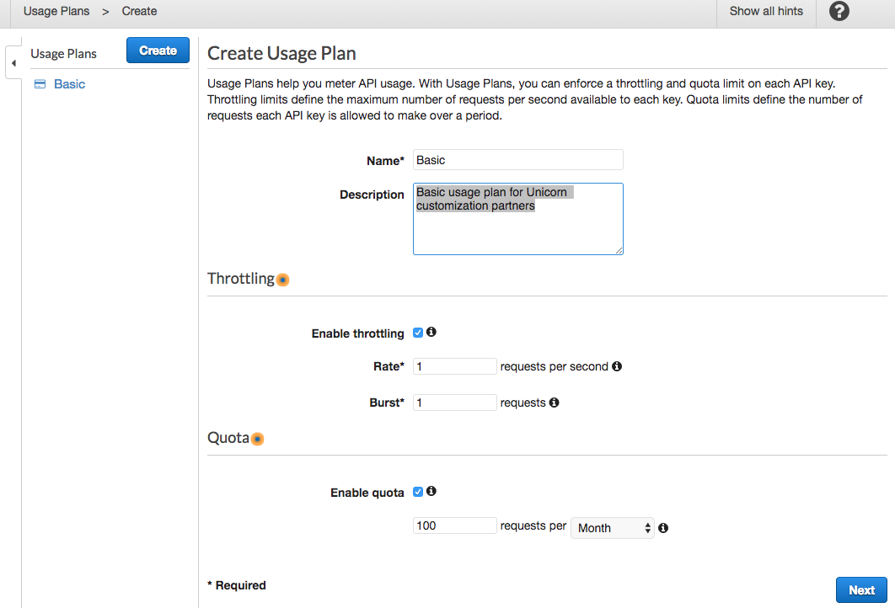
	
	**Next**をクリックします。
	
1. 作成した利用量プランに関連付ける先として、`dev`ステージを選択します

	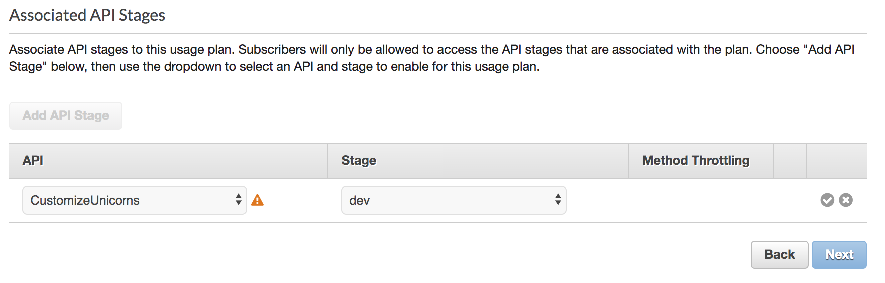
	
	> 警告マークは、APIキーを必要とするようにまだ設定されていないために表示されます。これは後のステップで行います。

1. checkmarkをクリックして   **Next**をクリックします。

	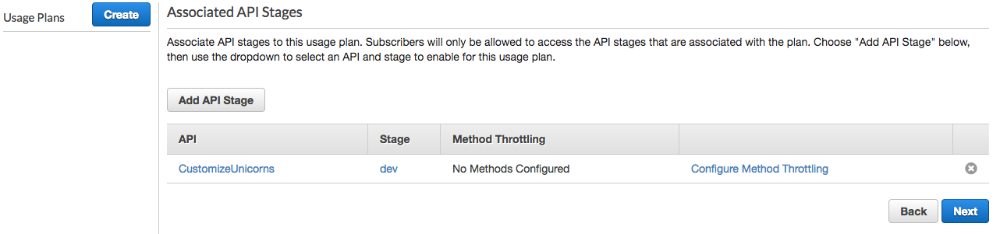


1. 現在、APIキーを利用するようにまだ設定していません。 ***Create API Key and add to Usage Plan**をクリックして、パートナー企業の APIキー を作成します。

	<details>
	<summary><strong> モジュール1をまだ完了していない場合、以下を実行してください</strong></summary>

	* Name  `cherry company`
	* API Key **Auto Generate**を選択
	* **Save**をクリック


	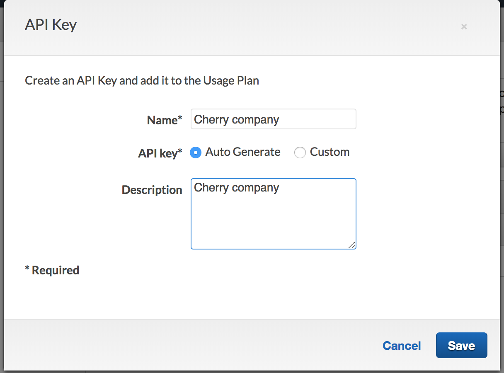
	</details> 
	
	<details>
	<summary><strong>モジュール1を完了している場合、以下を実行してください </strong></summary>
	
	今回のアプリケーションでは、ランダムな文字列を顧客が覚えなくてすむように、顧客のClientIDの値をAPIキーの値として利用します
	
	* Name: **モジュール 1: 認証**で作成した会社名. 
	* API Key:, 値を入力するために **Custom**を選択
	* 表示された入力ボックスに、会社の ClientID と同じ値を入力（忘れてしまった場合は、Cognitoコンソールから取得し、**App clients**タブを確認してください）
	* **Save**をクリックします
	
	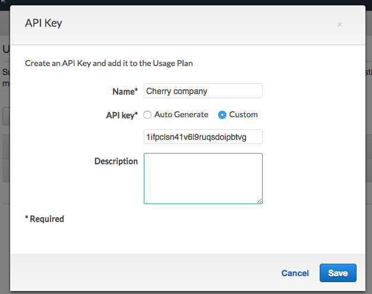
	
	</details> 


1. APIキーが作成されたら、**Done**をクリックします。

	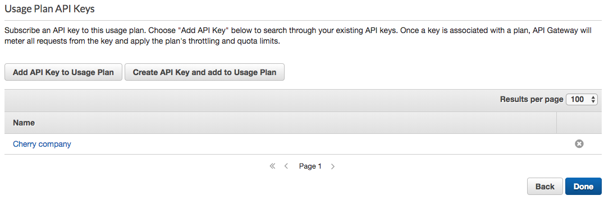
	
## モジュール 5B: API Gateway を更新して APIキー を強制する

次に、API キーを利用したリクエストに対応するために、API Gateway を変更していきます。


<details>
<summary><strong>モジュール1をまだ完了していない場合、以下を実行してください </strong></summary>


1. `template.yaml`の API Swagger の定義で、以下の行を追加します。

	```yaml
		      ApiKey:
	            type: apiKey
	            name: x-api-key
	            in: header
	```
	
	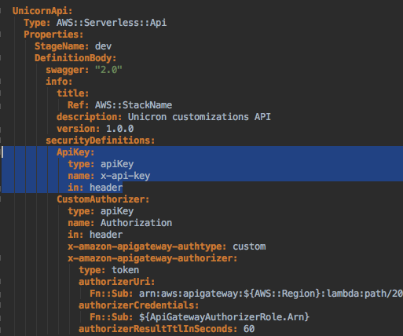

1. 次に、ユニコーンをカスタマイズしたり、カスタマイズオプションを一覧表示するための Swagger テンプレートのAPI に、以下を追記していきます。

	```yaml
	         		- ApiKey: []
	```
	以下のように、**それぞれの API の** `security` セクションに追記します。 ( `/partners` API は今はそのままにしておきます)

	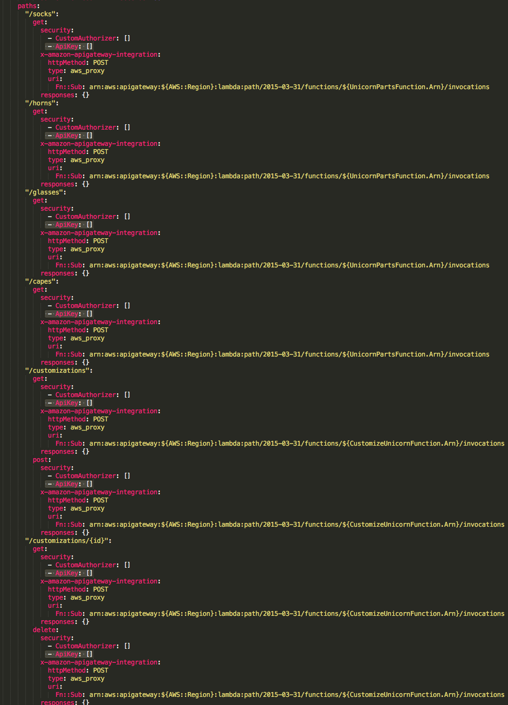

</details>

<details>
<summary><strong>モジュール1を完了している場合、以下を実行してください</strong></summary>


1. `template.yaml`の API Swagger の定義で、以下の行を探します

	```
	### TODO: add authorizer
	```
	
	その下に次の行を追加します

	```yaml
	        securityDefinitions:
	          ApiKey:
	            type: apiKey
	            name: x-api-key
	            in: header
	```

	以下のようになります
	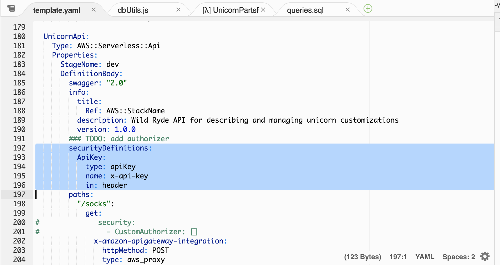
	
	&#9888; **Caution: 貼り付けた `securityDefinitions` セクションが `info` や `paths` と同じインデントレベルであることを確認してください**。 &#9888;


1. Swagger テンプレートの `paths` セクションで、以下の**それぞれの記述**を
	
	```yaml
	#              security:
	#                - CustomAuthorizer: []
	
	```

	以下に**すべて置き換えます**
	
	```yaml
	              security:
	                - ApiKey: []
	```
	
	以下のようになります。
	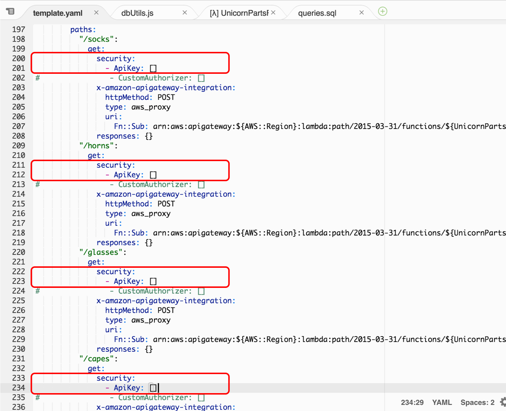

	&#9888; **Caution: 全部で9個の API を変更したことを確認してください** &#9888;
	

</details>

設定が終わったので、変更をデプロイして動作を確認していきます。

1. ターミナルでテンプレートを検証します。

	```
	sam validate -t template.yaml
	```

1.  変更をデプロイします。

	```
	 aws cloudformation package --output-template-file packaged.yaml --template-file template.yaml --s3-bucket $BUCKET --s3-prefix securityworkshop --region $REGION &&  aws cloudformation  deploy --template-file packaged.yaml --stack-name CustomizeUnicorns --region $REGION --parameter-overrides InitResourceStack=Secure-Serverless --capabilities CAPABILITY_IAM
	```

1. デプロイが完了したら[API Gateway コンソール](https://console.aws.amazon.com/apigateway/home)に移動し、**CustomizeUnicorns API** の **Resources** からメソッドを選択し、**Method Request**をクリックします。 

	**API Key Required** が`true` に設定されていることを確認します

	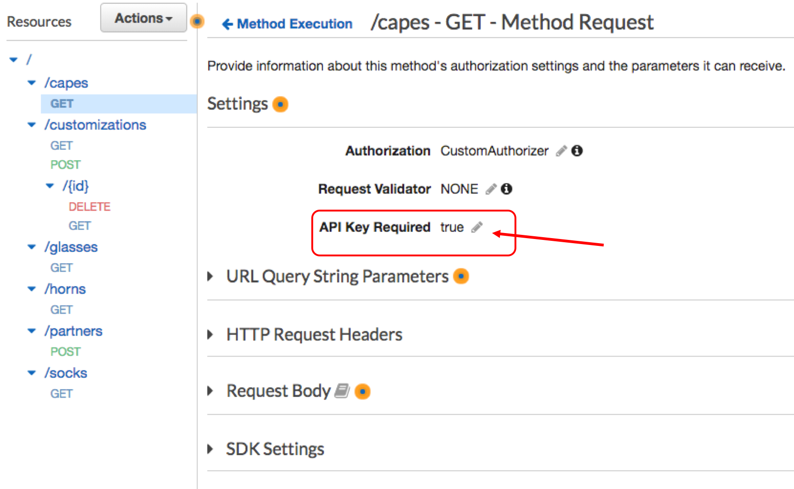


## モジュール 5C: 動作確認

1. Postmanを使ってテストします。API が APIキーを強制するようになったので、API キーのヘッダーを含めないとリクエストは失敗します。

	以前と同じように Postman を使ってリクエストを送信してみてください。**403 Forbidden** というステータスコードと `{{"message". "Forbidden"}}` のレスポンスが返ってくるはずです。

	> モジュール1を完了しており、**401 Unauthorized** が返ってくる場合は、アクセストークンの有効期限が切れている可能性が高いです。Postmanを使って新しいアクセストークンを要求して、もう一度試してみてください。

1. API キー のリクエストヘッダーを追加するには、Postmanの **Header** タブに移動して 
	* header keyに`x-api-key` を入力します
	* モジュール5Bで使用量プランに追加したAPIキーの値を入力します:
		* モジュール1完了の場合: Cognito の app Client ID と同様
		* モジュール1未完了の場合:  API gateway コンソールの **API Keys** タブ から、モジュール5Bで作成した APIキーを選択し、**API Key** の隣の **Show**をクリックして確認できます	


			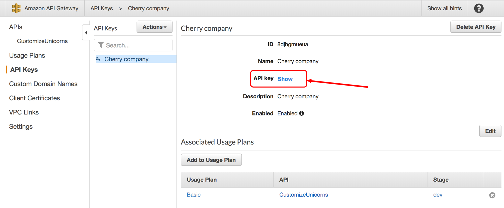 
	
	これでリクエストが正常に処理できるようになります
	
	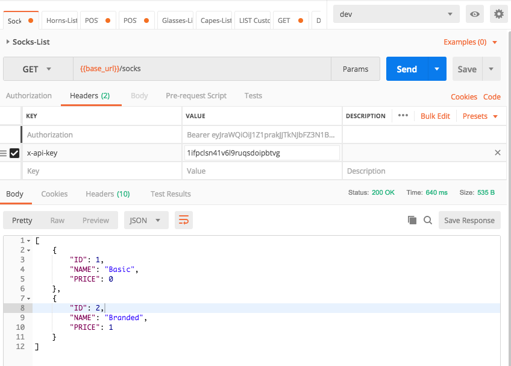 


## オプションモジュール 5D : Lambda オーソライザーで API キーを利用する


&#9888; **Caution: このオプションは、モジュール1を完了していることを前提としています** &#9888;

モジュール 1: を完了している場合は、API 利用者の利便性のために、リクエストに `x-api-key` ヘッダーを追加することを強制するのではなく、API gateway が Lambda オーサライザーから API キーを取得するようにすることができます。API gateway がサポートする APIキー の2つのソースについての詳細は[こちら](https://docs.aws.amazon.com/apigateway/latest/developerguide/api-gateway-api-key-source.html)を確認してください

1. template.yaml のAPI swagger 定義で、以下の行を追加します。
	
	```
	x-amazon-apigateway-api-key-source: AUTHORIZER
	```

	 `securityDefinitions` や `paths` フィールドと同じインデントレベルにします。
	
	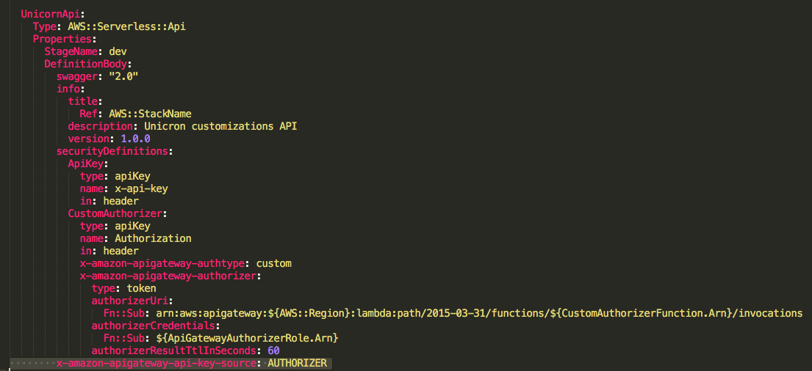 

1. また、Lambda オーサライザーが authレスポンスの一部として APIキー を返すようにする必要があります。これを行うには、`authorizer/index.js`にアクセスし、コードの中で以下の行を見つけ、2行目のコメントを外します。 

                        // Uncomment here to pass on the client ID as the api key in the auth response
                        // authResponse.usageIdentifierKey = payload["client_id"];

1. テンプレートを検証します。

	```
	sam validate -t template.yaml
	```

1.  変更をデプロイします。

	```
	 aws cloudformation package --output-template-file packaged.yaml --template-file template.yaml --s3-bucket $BUCKET --s3-prefix securityworkshop --region $REGION &&  aws cloudformation  deploy --template-file packaged.yaml --stack-name CustomizeUnicorns --region $REGION --parameter-overrides InitResourceStack=Secure-Serverless --capabilities CAPABILITY_IAM
	```

1. デプロイが完了したら、postman を使って再度 API リクエストを行うテストを行います。 `x-api-key` リクエストヘッダがない場合でもリクエストが成功するはずです。


## オプションモジュール 5E : postmanを使ったスロットリングの動作テスト

&#9888; **Caution: このオプションモジュールは、モジュール1と、上記のオプションモジュール5Dを完了したことを前提としています。 この2つを完了していない場合、コレクションの各APIにx-api-keyヘッダーを追加する必要があります。** &#9888;

postmanを使用して、複数のAPIリクエストを順番に送信することができます。

1. postmanで**Runner**をクリックします

1. `List customization options` フォルダーを選択します

1. Environment に `dev` を選択し、 iterationsに 10 を入力します

	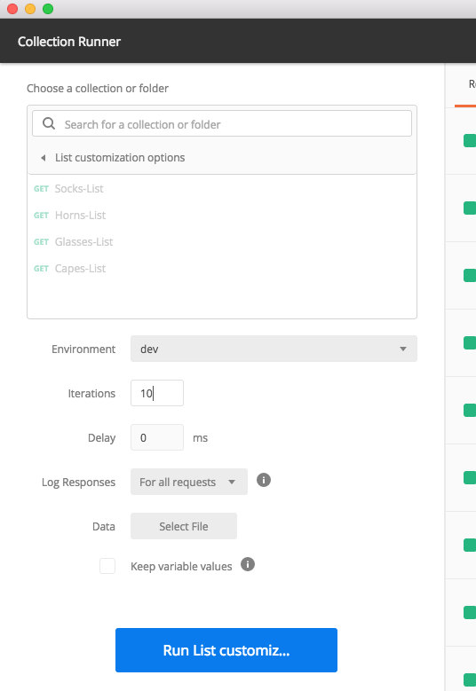

1. 以下のテスト結果では、いくつかのリクエストがスロットルされて429のレスポンスを受信しています。

	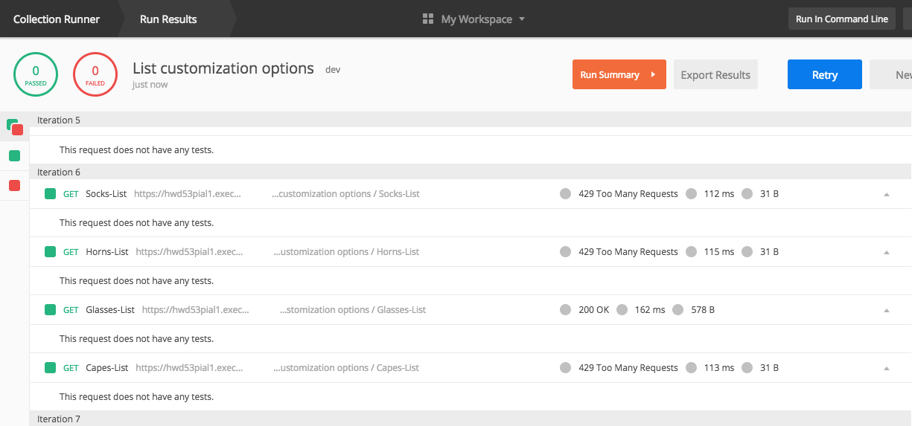


## 補足

時間があれば、以下も試してみてください。

* 特定のクライアントの使用状況データを表示/ダウンロードしてみてください。
	
	> **Hint**: [このドキュメント](https://docs.aws.amazon.com/apigateway/latest/developerguide/api-gateway-create-usage-plans-with-console.html#api-gateway-usage-plan-manage-usage) を参照してください

* API メソッドごとに異なるスロットリングしきい値を設定してみてください。

	> **Hint**: [このドキュメント](https://docs.aws.amazon.com/apigateway/latest/developerguide/api-gateway-request-throttling.html#apig-request-throttling-stage-and-method-level-limits) を参照してください

## 次のステップ
これで、API Gateway 使用量プランを使用して API 利用者のスロットリングを設定することができました。

ワークショップの [トップページ](../../README.md) に戻り、次のモジュールを選択してください。