# モジュール 6: WAF 

AWS WAF は Webアプリケーションファイアウォールで、アプリケーションの可用性に影響を与えたり、セキュリティを低下させたり、リソースを過剰に消費する一般的な攻撃から Web アプリケーションを保護します。例えば **SQLインジェクション** や **クロスサイトスクリプティング(XSS)** にマッチしたリクエストを拒否することができます。さらに、ルールを利用して**IPアドレス**や**地理情報**、**リクエストサイズ**、文字列や**正規表現**に基づいてリクエストをフィルタリングすることもでき、特定のユーザーエージェント、悪質なボット、コンテンツスクレーパーからの攻撃をブロックするためのルールを作成することも可能です。
また、**AWS Marketplace** にある **マネージドルール** を利用して、すぐにOWASP Top10 や  共通脆弱性識別子（CVE）などの一般的な脅威から API を保護することもできます。

このモジュールでは、WAF ACL を作成し、API Gateway にアタッチします。

### オプション: APIに対してSQLインジェクションを行う

もし **モジュール 3: API Gateway の入力値チェック**が完了済みであれば、API には JSON リクエストボディの基本的な入力検証が実装されています。しかし、SQL インジェクション攻撃に対してまだ一部が脆弱であることが判明しています。このオプションは、攻撃を実行する方法を示します。

<details>
<summary><strong>クリックするとオプションの手順が表示されます。 </strong></summary>


1. Postman で **GET Custom_Unicorn** リクエストに移動します。リクエストURLを変更して、SQLインジェクションを行うようにします。

	```
	{{base_url}}/customizations/1; drop table Custom_Unicorns;
	```

	**Send**をクリックします。 

	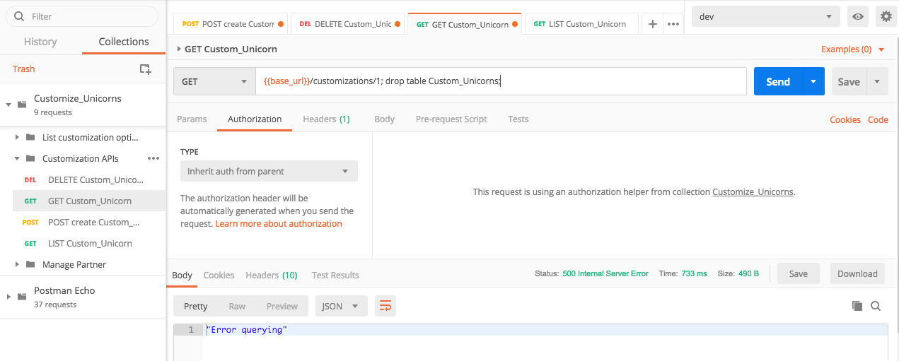

	SQLインジェクションの命令がすべて成功したわけではないので、`Error querying`というレスポンスが返ってくるかもしれません(どのような SQL クエリが実行されたかについては、**CustomizeUnicorns-CustomizeUnicornFunction** Lambda関数の Cloudwatch Logs で確認できます).  しかし、`Custom_Unicorns` テーブルを削除するためのクエリは成功したはずです。

2. 確認のために LIST や POST ような有効なリクエストを行うと、エラーが返ってくるようになっています。
   SQLインジェクションによって、テーブルが削除されています！

1. 復旧するには、cloud9 に移動し、mysqlコマンドラインを使用してデータベースに再度接続します
	
	```
	 cd ~/environment/aws-serverless-security-workshop/src
	 mysql -h <replace-with-your-aurora-cluster-endpoint> -u admin -p
	```
	
	モジュール 4 を完了した場合は、 設定した`admin` ユーザ のパスワードを入力してください。 
また、**モジュール 2: Secrets Manager** を行った場合は、Secrets ManagerによってDBのパスワードがローテーションされていることもあります。新しいパスワードを取得するには、Secrets Managerに移動して**Retrieve secret value** ボタンをクリックしてください）
	
	MySQL CLI プロンプトで show tablesコマンドを実行して `Custom_Unicorns` テーブルが削除されていることを確認します。
		
	```
	use unicorn_customization;
	show tables;
	```

	出力例 
	
	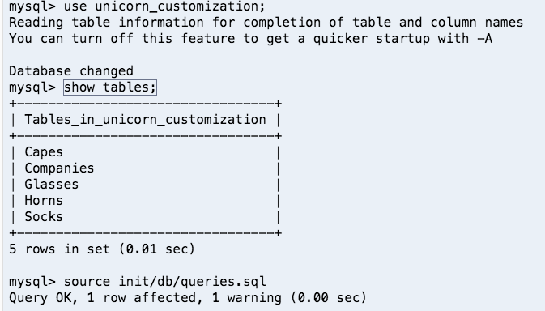

1. DB初期化スクリプトを再実行して `Custom_Unicorns` テーブルを再作成します。

	```
	drop table Capes, Glasses, Horns, Socks;
	source init/db/queries.sql;
	```
	
	> 下記のようなエラーメッセージが表示されますが、無視しても構いません。
	>```ERROR 1062 (23000): Duplicate entry 'Placeholder company' for key 'NAME'```
	> これは `company` テーブルを残したままスクリプトを実行したためです。
	
1. MySQL CLI プロンプトで `Custom_Unicorns` テーブルが作成されていることを確認します。

	```
	show tables;
	```

</details>

### モジュール 6A: WAF ACL の作成

それでは、AWS WAF を利用して対策していきましょう。

1. [AWS WAF コンソール](https://console.aws.amazon.com/wafv2/home#/wafhome)へ移動します。

1. AWS WAFは新しいバージョンがリリースされていますが ([AWS WAF 用 AWS マネージドルールの紹介](https://aws.amazon.com/about-aws/whats-new/2019/11/introducing-aws-managed-rules-for-aws-waf/))、このワークショップではまだ新バージョンには対応していません。そのため、今回はクラシック版WAFコンソールを使用します。クラシックに切り替えるために**Switch to AWS WAF Classic**ボタンをクリックします。

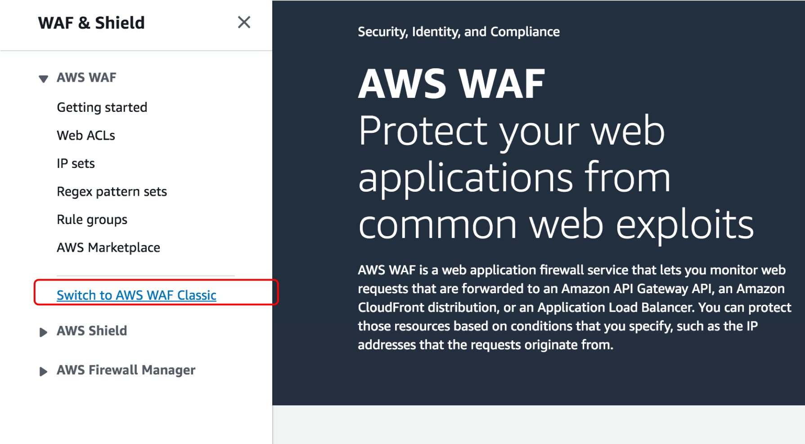
	
1. WAF Classicコンソールの **Create web ACL** をクリックします。

	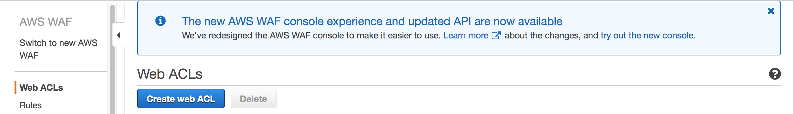

1. ACL作成ウィザードのステップ1で、以下を入力します。

	* **Web ACL Name**: `ProtectUnicorn`
	* **CloudWatch metric name**:  デフォルト（自動的に入力されるはずです）
	* **Region**: ワークショップの構築時に選択したAWSリージョン
	* **Resource type to associate with web ACL**: `API Gateway`
	* **Amazon API Gateway API**:  `CustomizeUnicorns` 
	* **Stage**: `dev`

	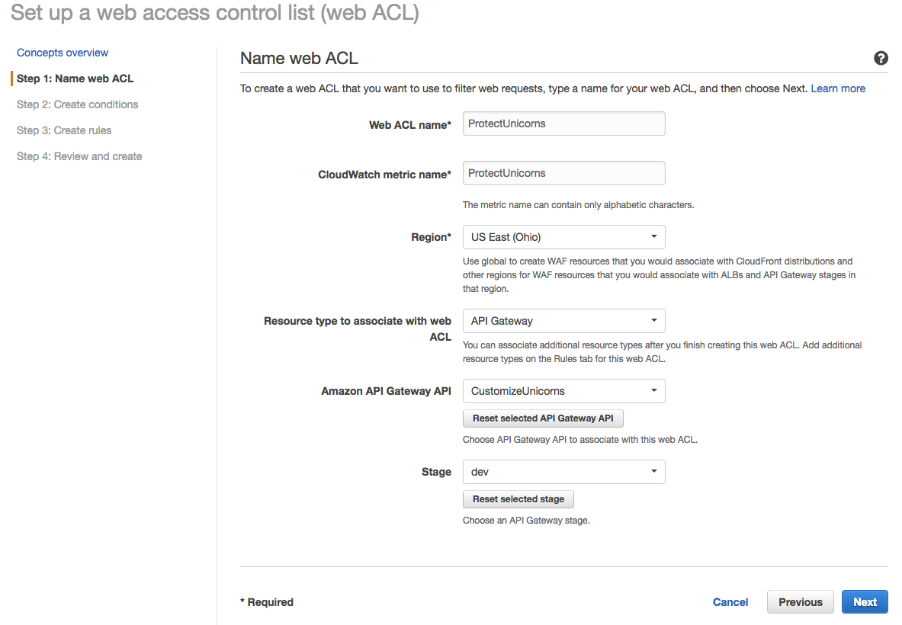
	
	**Next**をクリックします。

### モジュール 6B: WAF 条件の作成

1. 次に、2つの条件を作成していきます。まずはリクエストボディの最大サイズを制限する条件を作成します。

	* **Size constraint conditions** セクションに移動し、**Create condition**をクリックします
	* 名前として `LargeBodyMatch` を設定します。
	* In Filter settings, add a filer on 　条件の設定で、フィルターを追加します。
		*  	**Part of the request to filter on**: body
		*  **Comparison operator**: Greater than
		*  **Size (Bytes)**: 3000
	* **Add filter**  をクリックします。
	* 条件にフィルターを追加した後、**Create**をクリックします。

	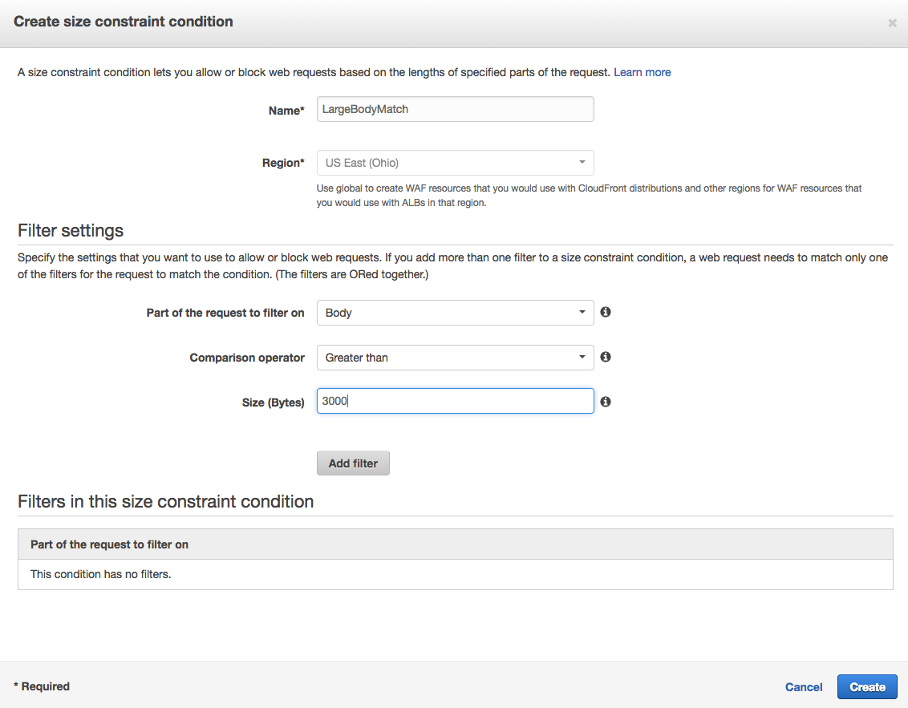
	
1. 次に、SQLインジェクション対策の条件を追加してみましょう。

	* **SQL injection match conditions** セクションに移動し、**Create condition**をクリックします
	* 名前として `SQLinjectionMatch`を設定します
	* ここでは、リクエストをより検査するために複数のルールを追加します
	*  **Filter settings**で以下の４つのフィルターを追加します

        <table>
        <tr>
          <th></th>
          <th>Part of the request to filter on</th>
          <th>Transformation</th>
        </tr>
        <tr>
          <td>1</td>
          <td>Body</td>
          <td>None</td>
        </tr>
        <tr>
          <td>2</td>
          <td>Body</td>
          <td>URL decode</td>
        </tr>
        <tr>
          <td>3</td>
          <td>URI</td>
          <td>URL decode</td>
        </tr>
        <tr>
          <td>4</td>
          <td>Query string</td>
          <td>URL decode</td>
        </tr>
        </table>

	* **Create**をクリックします。

		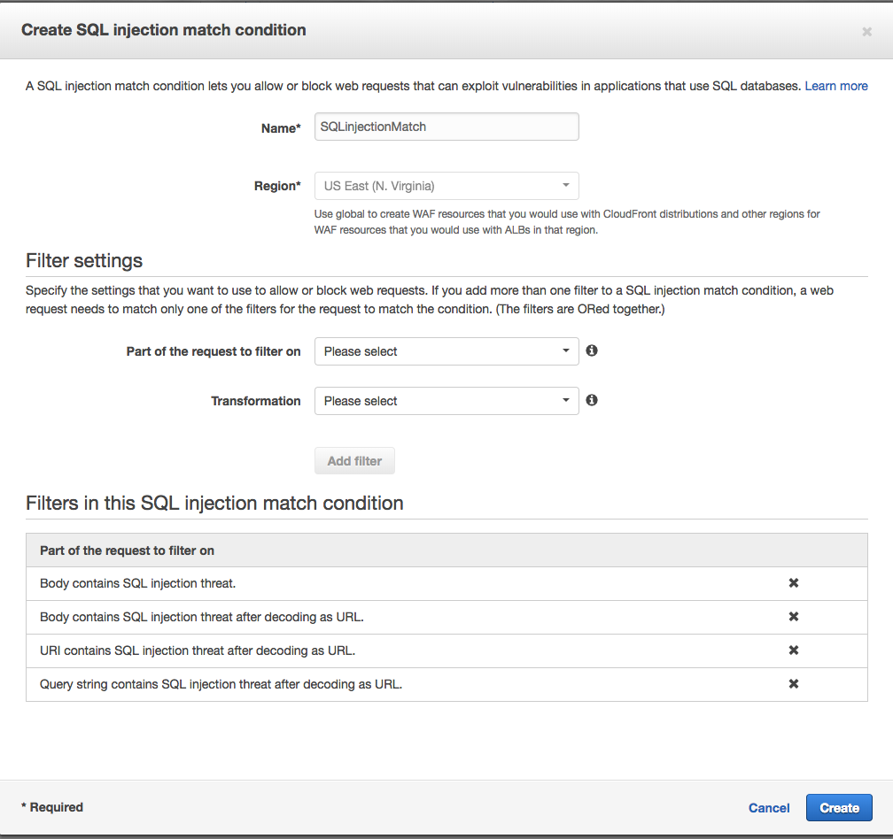

1. **Next** をクリックして**Create rules** ページに進みます。


### モジュール 6C: WAF ルールの作成

1. **ルール**は１つまたは複数の**条件**で構成することができます。まず、リクエストのボディサイズの条件を使ってルールを作成してみましょう。
	* **Create Rule** をクリック
	* 名前として `LargeBodyMatchRule` を設定します
	* **Rule type**は `Regular rule` を指定します
	* Add conditions セクションで下記を選択します
		* `does`
		* `match at least one of the filters in the size constraint condition `
		*`LargeBodyMatch`  -- さきほど作成したラージリクエストボディ制限の条件 

	* **Create** をクリックします
	
	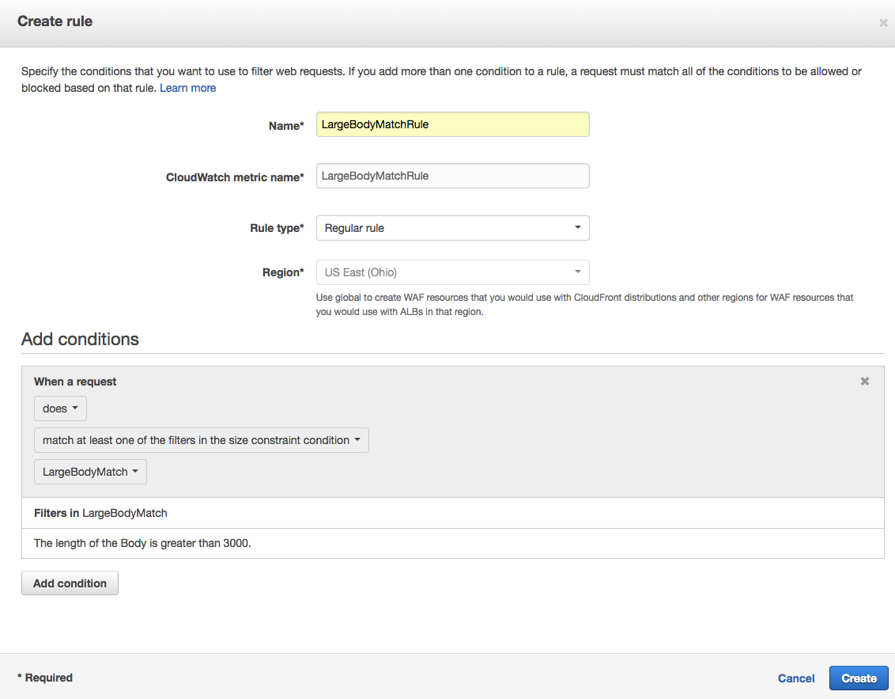
	
1. 次に、SQLインジェクション対策のルールを作成します。

	* **Create Rule** をクリックします
	* 名前として `SQLinjectionRule` を設定します
	* **Rule type**は`Regular rule`を指定します
	* Add conditions セクションで下記を選択します
		* 	`does`
		*  `match at least one of the filters in the SQL injection match condition `
		*  `SQlInjectionMatch`  -- さきほど作成したSQLインジェクション対策の条件 
	*  **Create** をクリックします

	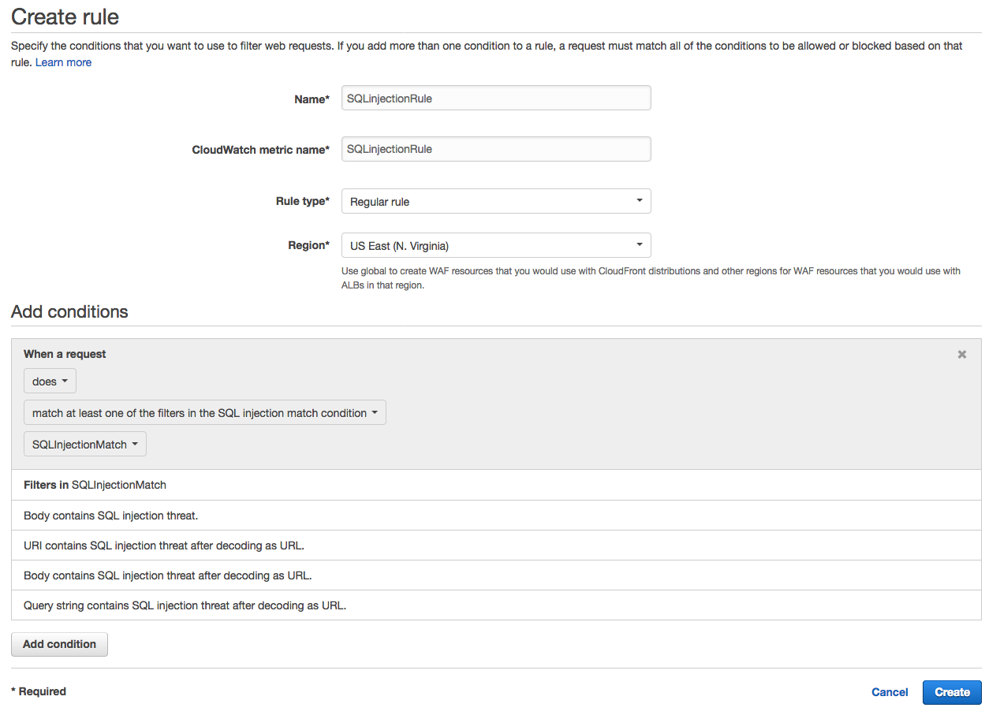

1. 最後に、圧倒的な数のリクエストが API に殺到するのを防ぐために、レートベースのルールを作成します。

	* **Create Rule** をクリックします
	* 名前として  `RequestFloodRule` を設定します
	* **Rule type**は`Rate-based rule`を指定します
	**Rate limit**に`2000` を設定します
	*  **Create** をクリックします

	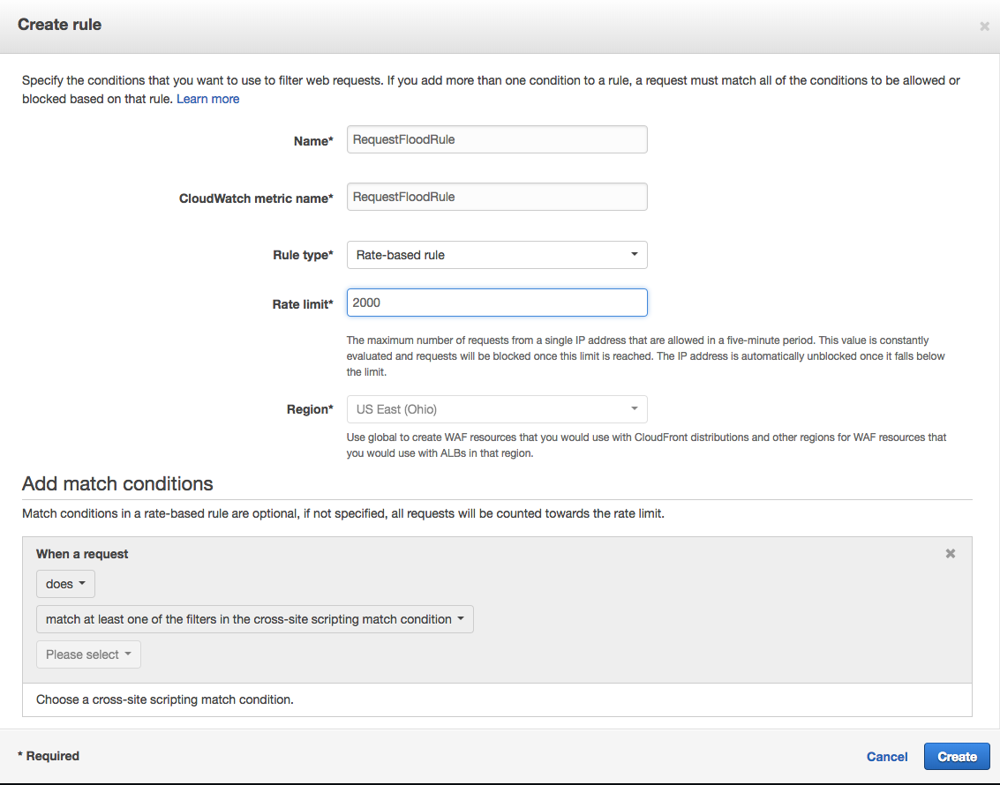

1. これで、以下のような3つのルールが表示されるはずです。防御を行うためにActionが`Block`になっていることを確認してください。

	また、**Default action** は `Allow all requests that don't match any rules`を選択してください

	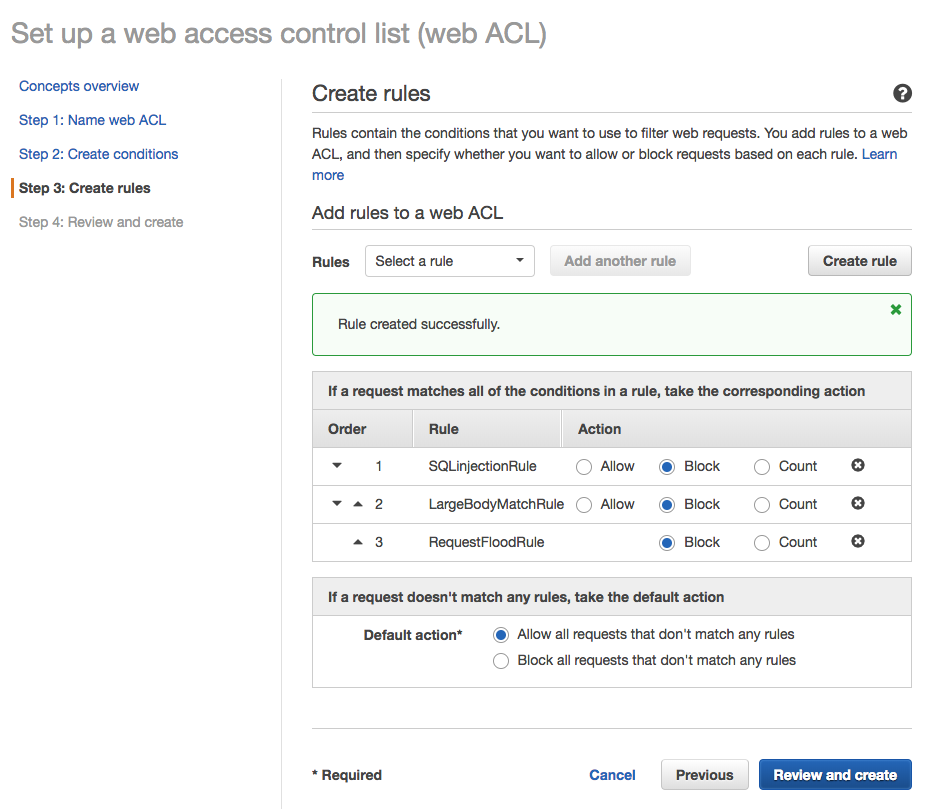

1. **Review and create** をクリックします

1. 次のページで、設定を確認し **Confirm and Create** をクリックします
	
	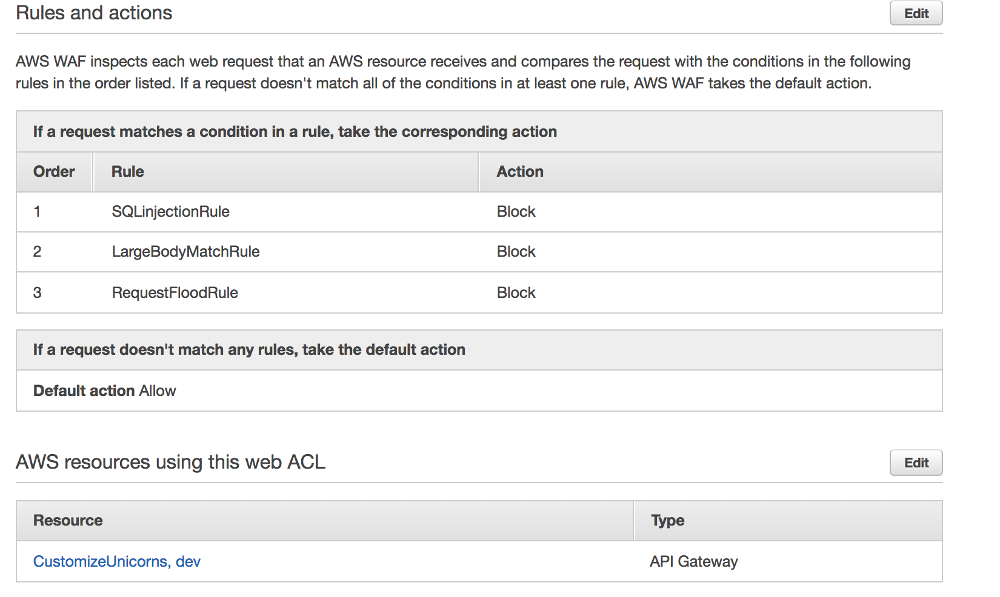

これで API gateway に WAF が追加されました！

### Module 6D: 確認のためのリクエスト送信

1. まず Postman で有効なリクエストを送信して、リクエストが正しく処理されているかを確認します。

1. 巨大なリクエストボディを持つ **post /customizations** リクエストを送信することで、リクエストボディのルールをテストすることができます。

	Postmanで、**POST create Custom_Unicorn**リクエストを選択して、リクエストボディを以下に置き換えます。

	```
	{  
	   "name":"my custom unicorn",
	   "imageUrl":"https://abc.efg.com/YA3K7yOwfmKhD1SdZ0MDB9C97RnJ3vb74WmoPOGJb2crs04okE2TcghSVgMWBLZ0c7rYZA5sjPWdfU7GJsRnEexwqgVfq2c94jEYdBCyxrZA3bZY36MiBnQZDrMyMMq1I8WJ7U4otss7mNWyQON0suZFXGCV7g7Z15dh14FIemSrkw3MzBLjsoAGTaz4VW1Ftljt5FCyJG3GtCSRvIoBkJ1YNiqKDRuiyFud7RgxBTXJEj3VvpTtT5CfWKPKKwfal4q506gW6aBgTeZGlhIGWlCxuT6sIYPodrXX4xmfukCFR32wtk7VgEiqYpKKwey2uQnZNQJHqwbHFZakppNYDQAeJ6NqB0tLDhERX2KtEiXH7iEJgAXeMLd7PNWrhYIlycsbcVnNrSpCmnBwADM3uVrKVF78qNGN2DnazascF3rIFSZJMPvNocSIT4zlK8VmXxB8inJb56UEHsYn9LAfVQMFcXPU3xwmKljk2fz5lHHs6vPeDnqjDNMEm1sXFq3S4759GZXzQubDcjYHX3REqeUNPYokrMAFb28qkfQwXUvrAq4Ov5eMXhFeXMBwupfqsSpPz0CMhr8o0M8sjG7ilXvrMo0jVcEmUrfRshkTHs55gZsaXP2CXjSbK0Z6sNiIiNtngAmHBZ1UkjJplirwVYLYAarYbghRdQswrWki447NtS0iFibgOjGkDXpFYwxaqNehMhalLUnP5jfz125V7HNzQ0wX5jgm42yGEjBaGNcI8hcySPXNI4jvT8RlZYxMs8m0zeZxxHEXqVfqVFYEr63gsI33nVPXS5jnJs7x3KY4wBOmOmwzWBBb62dBYBzqMwtRKp560MsR7uOK2hMGTBSdQtNubetRtu5JClGhlqE7Zv4SQ44lraE87vat55nXTgma7xpAjpwiH6yDQW6x1EXxjfVccjvR44FJNtUFVBh0DqUwoThR57SaEuIrLlP7e2pysgBI9GsYVt5RnXVUMXSPaDknVY4dFLVEPSEoOVRAt1kMcW9R3v3jURBBvTXfsFLzXn2t4DAYA1QmhJDkt9xpUOs1sviBYqjpUdhmRaun14Fx7aQiuwKAsfyJyVPbgZgmxOkeWpkf4ohcKwGZI8T6UlVWrwiRVL6eVQOdb3stNitObefEF7c9G9THQURzwpm7DanLTcAmnjlTyZS2NOW84it8QxDZ4qFGuxSjmzoGUUai9FRSpmyTozJvjmwZUFF5Codn9UWN2RrrEfKbuufl5ErPGRdyNkL73Hw9t1RG3UObmc0sf34z0JsHaL07StwB9HIXm5SLu9aZIpGoRu4UU23YL8jgORSXVop3HdkFifVTBf2w2mXaL0r07MHwLXQC7olLdNSXvj9uqVySHhAvAnhYquF0dwartwByZWT3Zt4i5gueuCb2LgrJJTSYQeDz9HIA4oDSnWj9BaxXKDuBTyLPwAdB4ER7I2Kl7lgdKuknaHXh5z9f4ybonueDv3RBd2Hcny5256im7jE6rEIWtTIbTKCR0frmpWm2smmwfL2IQIJE0lp5kxfDroqNf5l1XrovOo9sTD4LYIf88mUI3cAbBwNnPDtSZIWTJ3XcoK8Rm88xb3xKUxCZsQNnxBJM1eWzrYe4rSzIKk887GwwBAK1NFustp8bxSS3F73e2Oh9ijpbFBaAgmlG7nb21pEMBAw3G0yK6Hb0YePZvtXCxPQXDzFg5ya5BvqVPZESIAlkxNCz7kr0lTYJgwnixLUyM6gW6BekQAznQdaTK8LHYN9xJZusRgcSsVmfmA59KZ4J4oKxSAF4G14yI1P1Hj3juHHP8A90OjHfDvzkxGgL81CduPkBhyTRlhXg5mfIcEVGCViySt3cQGSYj43uo3sJ0JD77G7s5rc8kcc9VKPJ7sm1KZwNhF5lj6Ew1IOLG45xhrOOcJ8IvWAutcbFScOU0bZqwXyAi1ZLagPeVkkUBVHQKlHDUaQsuWXYnGyEO51Q5rgv6zdeFJlc32bjO1KelHURGznCHQgMB4rUlQUff482NWtoIC97Sp2es71nH88vzJf3yEiALXPe9a2XIWq5iAJpOr5SFFYJApDQ84k7UTLp2eiv7pZObd8CoT1RM7D5HepHdULl2wuzOKzugK7rQSgFrdndZEstMwwl0Rd6QH7ecuyidcjebuxT021M98ngzHBnki0muGFpYtWeO88IrqFsvSdb7PwARLZQFERcRfkYmynJ2xLnYLsNGw3Zim8lMqBKj06OrY6obubc5oNxyk3tzYAuhJhouNj6qIMaQYSBxkmDQuMsjJ8ULTaODdJuBNxp6wYPNyR4150dKukBc3fifzhcXQZP5KRudVf1nsDLYvQILifTJzSa01vwyxEhqCAEFZXnGuhANOwPWYuB5iagGErZ1MfNmlBCqYycveVjU0M7JWxZBPvHzLDFb3K9p91lO9URPXsieywBkFiP9RY0kSdktrwF8gHBiqacxPKFoS80o4PRfjr18ZOkT3XKGFiaQ9N3ubU1JzfGa3wvguPwlt0B4xk50jVnI45qeJAMpWBwEC8niMO7DIVBwxN0ERVrLpoOwdsE97xisGz5utDMqGi7IUpHozeCne9HYYxRAbia9skHgxAdsu64O7MSunuKxNs48wP9ClaeFyu6Yq6K8pGfUz54hxuDozlMRsIeawrqzj4CFl7AlDAtHyBLLuZIoAYo4f5evKyTPkcrF32YhhtINxlKGBJzCWKr6CTr76sPrbIbCyca94ymUILS09e0OYM7hlUqbzL4BBcPAWdr76akCmemeWayWbeF5piZUN4Zx8du5QINRnBGZo6T1CQmIQYJEEKKaQYfIiykitvq9v4ITF7TukiP1STzPJpL9SIJcxOBZjFmVaCK9sJeFQasXgJu2pAgdW41h0e8t7ygrlR6VZG1mKvk6QmTSCNOhMVrM5R74ZMlBfsJzvrOFgzoed0qOJg3rV4Te3BthONwYme1h9f5vQGRsxUu3UQnbIx8tIgVCYOsAEt6Jjho58AYYyZSGC5QYwRmqX6qd2O2cl8razz8cECzrGgHHaUsWVynpnW7RyAhZ6WrjN5sXANcRtEoeyK7gSIp9M0KhrItJNh0a6M6TEfFLMKOXV19YjZkJoalv5nQoy9V7dexFzvmtEtwnPwClSSEr9HczxFkpMCKzoCJwnlNlgSqkZ2Pw4mQSt05OmNqiyhnDw1rzTQgdMv8YdbWoD9Wkiln0UXghv816dcV3ZZD2UtF5yIeU4oo39ghfHW8MoccOcp6iasAMaEiENwha9D2p9J2Z0SwsOiS9gtjwVh4KdMc4EKcJdHkQAJ2iL3ZTulpuHmBo5yczOkJh2k1EZ7qaamOccvuxCPQE3Yofh5ztwHCIMFoM9pqRJRrW2ZXY1VbHKotiNSrWXnzunOKRktCEIKHXb4kN3q3iDwpiW5Ndno3I9CDmb5HihMsTom5kUmQIwgJpWZkrSUkakNbIP0eUe9GgosjqsvGNax9is46zedXoMHqwF1Qg7MQfy23NtCAvndwkpwmaoaFmhObg9TpFmI6skEmDrPAw4pArL0LalgPFXiqxoVyOouPdgwk6U1gQaWLG0gWBRki1RPn0Ikw6j4MAvs0jIVetqBNkTnLmVPU7qxHxMv0jxiDta8xz12LfQeOSQmtvjn66W5GwBy4KAvtttUKzgApJQOEUq2ynPXoKmtzlY9UQ9TAapTHm1qQA2FoZOL4GE9lKPAY4VxjsDFk1WvyCvWVlAkVT8qIlhOmnPPw0l7o9DpnMt66Hls6OJuqIfwisBhidht2MMw5nZ76gDbSrYKq3lVfMow9MGz9xfEoxFyWxPNEFlN0VUsLFvA37NwwuiwueIt6HjnGWdYcLe1LqZLtUwtQjLuizq87OYT6WKrGxnjqMFfBhEbdGBRIzioPLlRQijBMTdh0iD2YXwU4gdRMTGyb4ZrYmry0aiKojCTEZ5wFFvnDnIeaz869chZdhSb7QxeLpOZSwjsaSSyAhSY2fU3S08GQnCM7z5qvNHzvFbyFDaCh5h1YNysdyPs6Sml5wGqu475hBQnGkQiHNYbTfNohqIMyPpHju1OlbqP8P77DLy39cFf7j8EE7ExhHwI4tiDjiV0ipIYOuTPQZGe12XBu1kAYDcy4I9YqnSIx184JIOayPTdjJOXJ6DzdBfkePpLOWhHVoYaYYGkhzZgcoaPpjxGFhkZF32s28oOKXLTZx98eE9DRd7riISYn8O7nLpIVNJlH5J7pDdobAdGshjfgY7I5SfeaiI6MiE7rDnnyBXDy0SFId8zmpWYmXyBVw5rIrvy1Q8f0JSHhP6NoPcPeF3wbMVOdJ5d5OBZZrO1QhLeWvpEMzBV03xCK9vP985NRzWvOuWkLQXHNANmGhekspm6DruDSAkgU9qpBgUonwsfszz5TiP3F2CKFDGp3BXTBbRmy9nizz3wULa6Ny3276ILHpiFHl7g6H1Bkpo9g5EROGz7PNwxOw0wBJ74UEyky31CYDzanN45kvbf3crM9V8V0Y8B4zD5VSwW1M3RqEYWcyrRkgArjpEEkaWhyyMC7dCk6DWrbdxlDS9iD6gNXMIA1frZu1UegacgPuCsakfz262CJ6Qdyk6xkN97zH8iZakMnx570lipWm4wSbAlTkQVL88NfLHAnaS3kLeSTLkZFtULiKGahy4HkusJsn55dbxu1h7AtWFF54FOhGzGa9yxxnSqbn56KYASpghTOecg0du6ttjEE7ajbYFlOnF1atHOvSKskY9WZdMuee5yBvKQKIwXvUtyrDF55v8ArlEBHl3WFJf08KoYQrF6yxIxDXxhjG3I32G2Qxlj7o6dunk7yEvkrFeKwYpwqHUYs1UlJwoxpEyIjdppOxOxMysILvdh9eSvCdiq2nufwBeLxQqWoHQKa1kDHDR8gGm4ASDcoy53fZB9WykV0ylvpbzJtsPrKIXyTEV8FLUx3FcUkCCCcBuh8t3hCMpMOuSe0EsSjBaInXtR2h0nL7MGq8lUicCIbeVBfkF4O",
	   "sock":"1",
	   "horn":"2",
	   "glasses":"3",
	   "cape":"2"
	}
	
	```
	
	**403 Forbidden** という応答で、リクエストがブロックされていることを確認してください。
	
	&#128161; **Note:** WAF の変更が有効になるまで 数分ほどかかるかもしれません。正常な応答があった場合は何度か再試行してください。 &#128161;

1. 次に、**GET /customizations/{id}**リクエストのリクエストURIに SQLインジェクション攻撃を加えたリクエストを試してみましょう。

	Postmanで**GET Custom_Unicorn**リクエストを選択し、URLを以下に置き換えます。

	```
	{{base_url}}/customizations/1; drop table Custom_Unicorns;
	```

	**403 Forbidden** という応答で、リクエストがブロックされていることを確認してください。

1. WAFコンソールで、許可/拒否されたリクエストのメトリクスとサンプルを見ることができます。この情報は、WAFコンソールの **Web ACLs** でAWSリージョンを選択し、先ほど作成したWAFを選択することで確認することができます。

	**Note:** メトリクスとサンプルリクエストが表示されるまでに数分かかることがあります。

	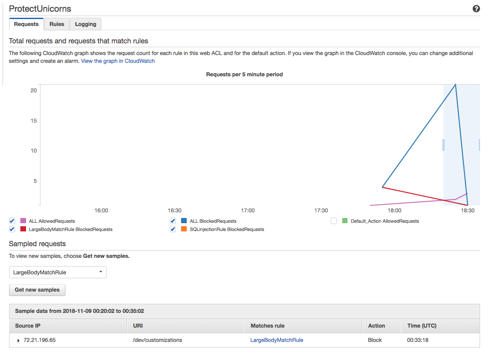

## オプション: レート制限の確認

[Artillery](https://artillery.io/docs/getting-started/)のような負荷テストツールを使用して、5分で2000以上のリクエストを送信してリクエストフラッドルールをテストすることができます。

Artilleryが `Authorization` ヘッダを付加して送信する設定になっていること注意してください。

**モジュール5: Usage Plan**を完了している場合は、WAFではなく利用計画によってAPIがスロットルされる場合があります。

## まとめ

このモジュールでは今回、WAFルールを３種類作成しました

* SQL インジェクション
* リクエストサイズ上限
* レート制限

この他にも様々な種類が用意されており、防御したいリスクによって利用することができます。

その他のルールについては、以下をチェックしてみてください。

* AWS WAF セキュリティオートメーション: [https://aws.amazon.com/solutions/aws-waf-security-automations/](https://aws.amazon.com/solutions/aws-waf-security-automations/)
* AWS Marketplace : マネージド WAF Rules: [https://aws.amazon.com/marketplace/solutions/security/waf-managed-rules](https://aws.amazon.com/marketplace/solutions/security/waf-managed-rules)

## 次のステップ

ワークショップの[トップページ](../../README.md) に戻り、他のモジュールを続けてください。
