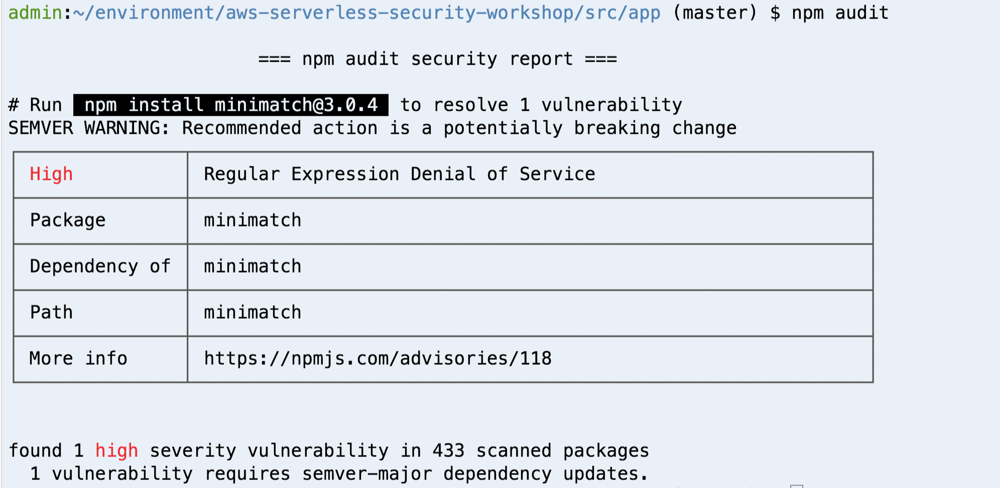

# モジュール 7: 脆弱性のある依存関係

モダンアプリケーションを構築する際には、一般的には異なる依存関係のライブラリ、モジュールを使用するのが一般的です。しかし、単純な依存関係であったとしても、実際には何十、何百もの依存関係になってしまうこともあります。例としてこのページを見てみてください。

- [http://npm.anvaka.com/#!/view/2d/request](http://npm.anvaka.com/#!/view/2d/request)

*request* のような複数のアプリケーションで使用されるモジュールは、60個(!)のリンクが含まれています。 この中に脆弱性のある依存関係があることの影響を考えたことがなければ、この[ストーリー](https://www.theregister.co.uk/2016/03/23/npm_left_pad_chaos/)を是非読んでみてください。 

このモジュールでは、既知の脆弱性がある依存関係を見つけて削除していきます。脆弱性のある依存関係を監視するために、さまざまな便利なツールがあります。以下にプログラミング言語に応じたツールの例を示します。


- [npm-audit](https://docs.npmjs.com/cli/audit)
- [OWASP Dependency Check](https://www.owasp.org/index.php/OWASP_Dependency_Check) 
- [Snyk](https://snyk.io/)
- [Puresec](https://www.puresec.io) 
- [Twistlock](https://www.twistlock.com/)
- [Protego](https://www.protego.io/)

このワークショップでは、npm-audit を使用してコードをレビューしていきます。

## *npm audit*による脆弱性のある依存関係の確認

脆弱性のある依存関係のチェックのためのツールは、プログラミング言語によって様々なものが用意されています。NodeJSでは、npmが NSP(Node Security Platform) を買収した後、脆弱性チェックが `npm` パッケージマネージャ自身に同梱されるようになりました。

`npm audit` コマンドを実行すると、脆弱性のレポートと、可能な場合には解決するためのコマンドが生成されます。（実際、`npm install`でパッケージをインストールすると、`npm audit`が自動的に実行されています）


1. Cloud9 環境で、`package-lock.json`があるノードアプリケーションディレクトリに移動します。
	
	```
	cd ~/environment/aws-serverless-security-workshop/src/app
	```
	
1. 下記のコマンドで脆弱性のチェックを行います。

	```
	npm audit
	```
	
	このような出力が表示されます。
	
	

`minimatch:2.0.10` の依存関係には既知の脆弱性があることが判明しました。 レポート内のリンクを読むと、どのように悪用されるかの詳細を知ることができます。

レポートで提案されているようにこの依存関係にパッチを当てる前に、最初に考えることがあります。アプリケーションは *minimatch* を使用しているのでしょうか？ このライブラリは、2つの異なる式を正規表現と比較して、それらが一致するかどうかを調べるものです。

今回のアプリケーションはこのライブラリを使用していないので、ライブラリを削除したほうが良さそうです。（これはソフトウェアプロジェクトにおいて、ライブラリがコードベースにpullされてよく起こることですが、コードの開発がすすんだ後、依存関係はもはや必要ないものとなっています）

しかし、どの依存関係を使用していて、どの依存関係を使用していないのかを判断して、未使用の依存関係を安全に削除するためにはどうすればいいのでしょうか？

### 静的分析を使用した未使用の依存関係の削除

別のツールを利用してコードをレビューし、どの依存関係がコードに含まれていて、どの依存関係が使われていないかを確認します。

1. 以下のコマンドを実行して、[depcheck](https://www.npmjs.com/package/depcheck?activeTab=readme)をインストールします。

	```bash
	npm install -g depcheck
	```

2. 以下のコマンドで実行します。

	```bash
	cd ~/environment/aws-serverless-security-workshop/src/app/
	depcheck
	```

	このような出力が表示されます。
	
	```bash
	$ depcheck
	Unused dependencies
	* babel-core
	* babel-plugin-transform-flow-strip-types
	* babel-preset-es2017
	* minimatch
	Missing dependencies
	* aws-sdk
	```
	
	上記のレポートから、未使用の依存関係がわかります。以下のコマンドでこれらを削除します。
	
	```bash
	npm uninstall babel-core --save
	npm uninstall babel-preset-es2017 --save
	npm uninstall minimatch --save
	npm uninstall babel-plugin-transform-flow-strip-types --save
	```

また、レポートには **missing dependencies** があることに気付くもしれません。これは、[AWS Lambda runtime](https://docs.aws.amazon.com/lambda/latest/dg/current-supported-versions.html)に既にインストールされている `aws-sdk` パッケージを使用しているため表示されています。

未使用の依存関係を削除したことを確認するために、`depcheck`を再度実行してください。

これで、脆弱性のある依存関係を解決することができました！

>
> これらのステップは、CI/CD パイプラインの一部として、すべてのデプロイメントで確認されるようにすべきです。

## 補足

2019年10月まで、このワークショップでは [Puresec Function Shield](https://www.puresec.io/function-shield)というフリーツールを紹介していました。
このツールは、以下のような Lambda関数のランタイム保護を追加で行うことができました。

* Lambda 関数からのアウトバウンドのネットワーク通信をブロック (必要ない場合)
*  `/tmp` の無効 (利用していない場合)
* Lambda コンテナ内から子プロセスを起動する機能を無効

しかし、2019年10月現在では商用製品としてプロジェクトに組み込まれています([https://github.com/puresec/FunctionShield](https://github.com/puresec/FunctionShield) )

この分野で提供されている他の商用製品については [AWS Lambda パートナー: security ](https://aws.amazon.com/lambda/partners/?partner-solutions-cards.sort-by=item.additionalFields.partnerName&partner-solutions-cards.sort-order=asc&awsf.partner-solutions-filter-partner-type=use-case%23security-identity-compliance) をご確認ください。

## 次のステップ

ワークショップの[トップページ](../../README.md) に戻り、他のモジュールを続けてください。

