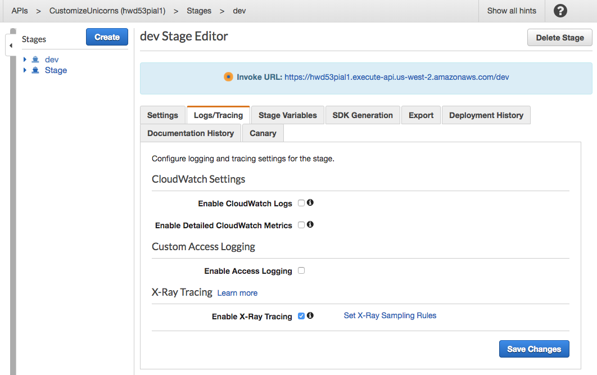
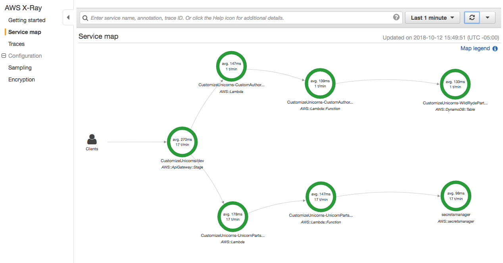
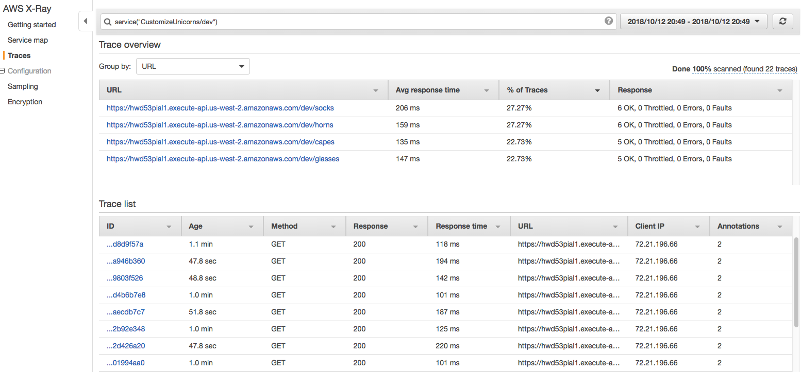
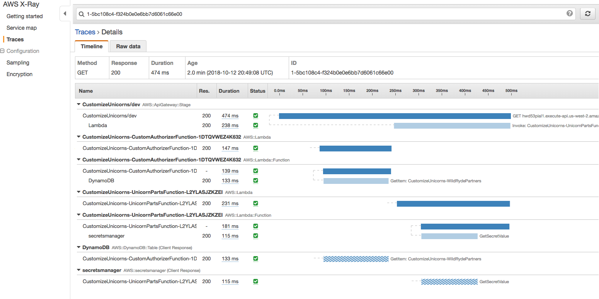

# モジュール 8: AWS X-Ray

「不十分なロギングとモニタリング」は  [OWASP](https://www.owasp.org/index.php/Main_Page) Top 10 - 2017 でランキングしたアプリケーションセキュリティのリスクの1つです。

AWS X-Ray は、マイクロサービスアーキテクチャのデータフローを可視化し、アプリケーションの基礎となるコンポーネントがどのように接続されているかの情報を提供します。これはパフォーマンスのトラブルシューティングやエラーのデバッグに最適なツールですし、 サーバーレスアプリケーションの迅速性や変更スピードを考えた際、アプリケーションに対するこの可視性は、セキュリティのためにも重要です。


* X-Ray は分散サーバーレスコンポーネントのデータフロー、相互依存性、パフォーマンス特性の「正常な状態」を理解するのに役立ちます。これを知ることは、異常を認識するための前提条件です。
* セキュリティインシデントや解析において、X-Ray はコードが実行時に何をしているのか、どのような依存関係を呼び出しているのか、コードがどこで時間を費やしているのか、ということを洞察することができます。

## モジュール 8A:  Lambda 関数で X-Ray を利用する


Cloud9 IDE 環境で SAM テンプレート(`template.yaml`) を開き、[**Globals**](https://github.com/awslabs/serverless-application-model/blob/master/docs/globals.rst) セクションを確認します。これは SAM テンプレート内のすべてのリソースの共有設定が含まれています。

```
Globals:
  Function:
    Timeout: 30
    ...
```

Lambda 関数の設定セクションに `Tracing: Active` を追加します。	

```
Globals:
  Function:
    Timeout: 30
    Tracing: Active
    ...
```

## モジュール 8B: AWS SDK リクエストのキャプチャ

アプリケーションが Secrets Manager、DynamoDB、S3などのAWSサービスに通信を行う場合、X-Ray SDKはこの通信を追跡し、AWSサービスコールに関するリクエストタイミングやステータスなどを記録します。

この機能は `aws-sdk` を require している部分を `AWSXRay.captureAWS`に置き換えることで、簡単に利用することができます。

### Lambda オーソライザーからのリクエストのキャプチャ設定

[**モジュール1: 認証と認可の追加**](../01-add-authentication) で追加したLambdaオーソライザーは、DynamoDB のテーブルを参照する際にAWS SDK を利用しています。X-Ray を設定するために下記を実行します。

1. ターミナルで以下を実行して、`authorizer/`フォルダに XRay SDK をインストールします。

	```bash
	cd	~/environment/aws-serverless-security-workshop/src/authorizer 
	npm install aws-xray-sdk-core --save
	```
	
1. `authorizer/index` で、AWS SDK をインポートしている行を探します。

	```javascript
	const AWS = require('aws-sdk');
	```
	
	この行を下記に置き換えます。
	
	```javascript
	const AWSXRay = require('aws-xray-sdk-core');
	const AWS = AWSXRay.captureAWS(require('aws-sdk'));
	```


### バックエンド lambda 関数からのリクエストのキャプチャ設定

<details>
<summary><strong>モジュール2(AWS Secrets Manager設定)を行ってない場合 </strong></summary><p>
バックエンドのlambda 関数は AWS SDKを使用していないので、次へ進んでください。
</details>

<details>
<summary><strong>モジュール2(AWS Secrets Manager設定)を行った場合 </strong></summary><p>
モジュール2で`dbUtils.js`に AWS SDK を追加して、[**AWS Secrets Manager**](https://aws.amazon.com/secrets-manager/)から データベースのユーザー名とパスワードを取得するようにしました。

1.	ターミナルで以下を実行して、`app/`フォルダに XRay SDK をインストールします。

1. ```bash
	cd	~/environment/aws-serverless-security-workshop/src/app 
	npm install aws-xray-sdk-core --save
	```
	
1. `app/dbUtils` で、AWS SDK をインポートしている行を探します。

	```javascript
	const AWS = require('aws-sdk');
	```
	
	この行を下記に置き換えます。
	
	```javascript
	const AWSXRay = require('aws-xray-sdk-core');
	const AWS = AWSXRay.captureAWS(require('aws-sdk'));
	```


</details>


##  モジュール 8C: 変更のデプロイと動作テスト

1. ターミナルで、SAM テンプレートを検証します。

	```
	cd	~/environment/aws-serverless-security-workshop/src/
	sam validate -t template.yaml
	```

1.  変更をデプロイします。

	```
	 aws cloudformation package --output-template-file packaged.yaml --template-file template.yaml --s3-bucket $BUCKET --s3-prefix securityworkshop --region $REGION &&  aws cloudformation  deploy --template-file packaged.yaml --stack-name CustomizeUnicorns --region $REGION --parameter-overrides InitResourceStack=Secure-Serverless --capabilities CAPABILITY_IAM
	```

1. デプロイが完了したら、postmanで再度APIリクエストを作成し、テストを行います。

1. [**X-Ray コンソール**](https://console.aws.amazon.com/xray/home)へ移動し、**Service map** タブを再読込みしてください。Lambda関数からのリクエストがキャプチャされているのが見えるはずです! 


## モジュール 8D: API Gateway で X-Ray を利用する 

1. [API Gateway コンソール](https://console.aws.amazon.com/apigateway/home) へ移動し、  `CustomizeUnicorns` API を開きます。

1. **Stages** タブの`dev` ステージをクリックします。

1. **Logs/Tracing** タブの **Enable X-Ray Tracing**をチェックし、**Save changes** をクリックします。

	
	
1. APIを再デプロイします。左側の **Resources** タブクリックし、**Actions** 、**Deploy API** から、`dev`を選択し**deploy**をクリックしてください。

1. postmanを使って、確認用のAPIリクエストを行ってください。

1. [**X-Ray コンソール**](https://console.aws.amazon.com/xray/home)へ移動し、**Service map** タブを再読込みしてください。

	

1. Service mapを確認します。各コンポーネントをクリックして、**View traces**を使ってX-Rayでキャプチャされたリクエストトレースのリストを確認してください。

	

1. 各リクエストをクリックして、トレースを探索することもできます。

	


## 次のステップ 

ワークショップの [トップページ](../../README.md) に戻り、次のモジュールを選択してください。
