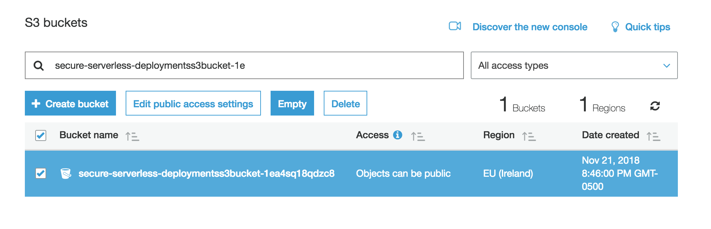

# リソースのクリーンアップ

このページでは、各モジュールで作成したリソースをクリーンアップする手順を説明します。
実施したモジュールについて下記の手順を実行してください。 

## Resource Cleanup Instructions

1. **モジュール1：認証**で作成した Cognito User pool domain を削除します 

	

	
<strong>詳細手順はここをクリックして展開してください </strong>

	
	1. [Cognito コンソール](https://console.aws.amazon.com/cognito/home)に移動します
	1. **Manage User Pools**に移動します
	  1. `CustomizeUnicorns-users` user poolを選択します
	  1. **App integration**の**Domain name**に移動します
	  1. **Delete domain** をクリックします
	  1. 確認して削除します

	

1. **モジュール5：使用プラン**で作成した API Gateway Usage Planを削除します 

	

	
<strong>詳細手順はここをクリックして展開してください </strong>

	
	1. [API Gateway Console](https://console.aws.amazon.com/apigateway/home) に移動します
	  1. **Usage plans** に移動します
	  1. `Basic` Usage Planに移動します
	1.  **Associated API Stages**の下の**Details**タブで、,  `CustomizeUnicorns` API を削除します
	1. 右上にある**Actions** をクリックし、**Delete Usage Plan**を選択します

	

1. **モジュール2: Secrets** で作成した AWS Secrets Manager の secret を削除します

	

	
<strong>詳細手順はここをクリックして展開してください </strong>

	
	1. [Secrets Manager コンソール](https://console.aws.amazon.com/secretsmanager/home)に移動します
	1. `secure-serverless-db-secret` の secret を選択します
	1. **Actions** から**Delete secret**  を選択します
	1. waiting period に`7`を入力し (最小値) **Schedule deletion**をクリックします

	

1. **モジュール 6: WAF** で作成した AWS WAF を削除します

	

	
<strong>詳細手順はここをクリックして展開してください </strong>

	
	1. [WAF コンソール](https://console.aws.amazon.com/waf/home)に移動します
	1. ナビゲーションから **Web ACLs**を選択します
	1. 作成した`ProtectUnicorns` web ACL を選択します
	1. **Rules** タブの右側にある Edit web ACLをクリックします
	1. 各行の右にある **x** をクリックしすべてのルールを削除します
	1. **Update** をクリックします
	1. Dissasociate the API gateway from the WAF by going to the section **AWS resources using this web ACL** in the **Rules** tab and clicking the  **x** at the right of the API gateway stage
	   **AWS resources using this web ACL**セクションの**Rules** タブにあるAPI gateway stageの **x**をクリックすうることで、API gatewayとの関連付けを削除します 
	1. **Web ACLs** ページで、削除する web ACL を選択し**Delete** をクリックします
	1. ナビゲーションから **Rules** を選択します. 
	1. Go to each of the 作成した３つルールについて、**それぞれ**条件の関連付けを削除します。
	1. ３つのルールを削除します
	1. 作成した３つの条件を削除します
	

1. CloudFormation の `CustomizeUnicorns`  スタックを削除します

	

	
<strong>詳細手順はここをクリックして展開してください </strong>

	
	1. [CloudFormation コンソール](https://console.aws.amazon.com/cloudformation/home)へ移動します
	1. `CustomizeUnicorns` スタックを選択します
	1. **Actions** から**Delete Stack**をクリックします
	
	

1. s3 バケットを空にします
	
	

	
<strong>詳細手順はここをクリックして展開してください  </strong>

	1. [S3 コンソール](https://console.aws.amazon.com/s3/home)に移動します
	1. `secure-serverless-deploymentss3bucket`で始まるバケットを探します
	1. バケットのチェックボックスを選択し、**Empty** ボタンをクリックします
	
		
	
	1. 確認ためバケット名を入力して実行します
	

1. CloudFormation の `Secure-Serverless` スタックを削除します

1. CloudWatch Logs のログを削除します
AWS Lambda は、関数ごとに CloudWatch ロググループを自動的に作成し、関数が呼び出されたときにログを書き込みます。 CloudWatch Logsの `/aws/lambda/CustomizeUnicorn` で始まる ロググループを削除します

1. RDS コンソールで Aurora データベースの RDS スナップショットを削除します。

クリーンアップは以上で終了です。

[トップページ](../../README.md) 

